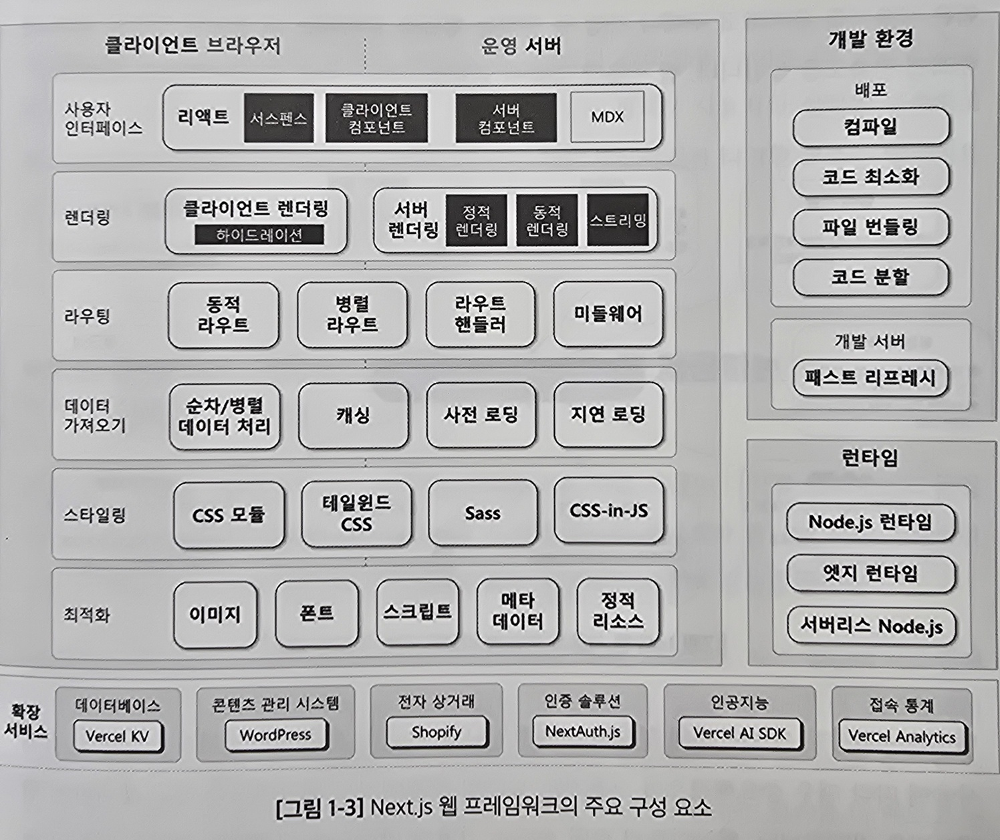

# 1.1 리액트와 Next.js 는 무엇인가?

## 1.1.1 리액트: 웹의 혁신적인 사용자 인터페이스 라이브러리

리액트 : 메타에서 개발한 사용자 인터페이스(UI)를 구축하는 JS 라이브러리

#### 특징

> 가상 DOM을 사용하는 크라리언트 사이드 랜터링 
> 초기 로딩 후 빠른 페이지 전환, UI를 동적으로 변경 
>
> 첫 페이지 로딩 속도가 느려질 수 있음 
> 검색엔지 최적화가 어려움

## 1.1.2 Next.js: 리액트의 한계를 극복하는 서버 사이드 프레임워크

Next.js : 풀 스택 웹 애플리케이션을 구축하는 리액트 프레임워크

#### 특징

> 리액트 컴포넌트를 사용해 UI를 구축 
> 복잡한 설정과 최적화 및 도구를 자동화 => 개발 편의성 증대 
> 서버 사이드 랜더링과 하이드레이션을 통해 리액트의 한계를 극복 
> 서버 사이드 랜더링(SSR : server side rendering) => 초기 로딩 속도 개선 
> 하이드레이션(hydration)  
> => SSR을 통해 전달한 HTML을 클라이언트 측 js와 연동하는 과정  
> => 클라이언트와 상호작용 가능

## 1.1.3 최신 리액트와 Next.js의 진화와 혁신

#### 아직도 남아 있는 문제점

- 모든 데이터를 서버에서 처리하는 SSR은 API호출로 인한 지연 발생 가능
- 하이드레이션을 통해 컴포넌트가 활성화되기 전까지 상호작용이 지연

#### 문제 해결을 위한 리액트 18의 변화

- 서버, 클라이언트 컴포넌트 도입  
  => 렌더링 효율성 상승
- 서스펜스(suspense) 업그레이드  
  => fetch 를 수행하는 컴포넌트의 로딩 관리가 세밀하고 효율적

#### 문제 해결을 위한 Next.js 13.4의 변화

- 앱 라우터 
  => 페이지 전환과 렌더링 효율성 상승
- 선택적 하이드레이션 
  => 앱 일부만 빠르게 활성화하여 상호작용을 가속
- 리액트의 서버, 클라이언트 컴포넌트 구조 활용 
  => SSR의 효율성과 SEO(검색 엔진 최적화)를 강화

> **이외의 개선사항** 
>
> - **증분적 정적 재생성(Incremental Static Regeneration, ISR)** 
>   데이터 변화에 따라 정적 페이지를 재생성해 최신 정보 반영과 최적화 실현
> - **하이브리드 렌더링** 
>   하나의 페이지를 여러 컴포넌트로 분할해 데이터 상태에 따라 서버에서 미리 생성  
>   혹은, 사용자 요청에 맞춰 클라이언트 내에서 즉각적으로 생성하거나 변경
> - **서스펜스 스트링밍(streaming with suspense)** 
>   서버에서 렌더링 된 페이지의 일부를 우선 클라이언트에게 전송하고  
>   나머지 부분이 로드되는 동안 사용자에게 로딩 상태를 표시함 => 신속한 상호 작용

## 1.1.4 Next.js 주요 특징

- 내장된 최적화 도구: 이미지, 폰트, 스크립트를 최적화하는 기능
- 서스펜스 스트리링: 리액트 서스펜스와 통합되어 서버에서 UI를 즉시 스트리밍함
- 데이터 가져오기: 서버와 클라이언트 모두에서 데이터 가져오기 지원
- CSS 지원: 테일윈드CSS, Sass 등을 사용해 앱을 스타일링
- Node.js 및 엣지 런 타임: 서버리스(serverless) 함수로 확장 가능한 솔루션을 구축  => 빠르고 동적인 운영환경 제공
- 라우트 핸들러: 프론트엔드가 외부 서비스와 안전하게 연결될 수 있도록 벡엔드에서 데이터를 불러오는 API 엔드포인트를 구축
- 고급 라우팅 및 중첩 레이아웃: 파일 시스템을 사용하여 라우트를 생성, 고급 라우팅 패턴 및 UI 레이아웃 지원
- 미들웨어: 인증과 보안 및 국제화하는 라우팅과 접근 규칙을 코드로 정의
- 타입스크립트 지원원

## 1.1.5 Next.js 웹 프레임워크의 주요 구성 요소

