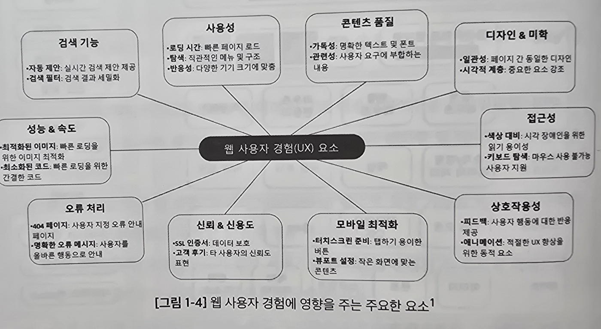

# 1.2 리액트와 Next.js로 얻는 사용자 경험 향상

## 1.2.1 웹 사용자 경험의 중요성

웹 사용자 경험(User eXperience, UX)는 사용자 유지와 가입, 구매에 중요한 역할을 함

#### 웹 사용자 경험에 영향을 주는 요소

## 1.2.2 즉각적인 사용성: 리액트와 Next.js가 제공하는 신속한 반응성

#### 즉각적인 피드백이 중요한 이유

- 시스템이 사용자의 행동을 인식했다는 것을 확인하여 불안감을 줄여줌
- 반응이 빨라야 사용자가 더 적극적으로 상호작용함 => 참여도 증가
- 대기시간을 단축해 사용자가 원하는 결과를 빨리 보여줄 수 있음

## 1.2.3 시각적 부드러움: Next.js를 활용한 매끄러운 페이지 전환

요즘 사용자는 원활하고 끊김없는 경험을 기대함

Next.js 는 리액트 기반의 SPA 패러다임을 이용해 Link 컴포넌트 도입 
=> 전체 페이지를 다시 불러오지 않고 즉시 다른 페이지로 이동 
=> 사용자의 내비게이션을 효율적으로 만듦

> Next.js의 미리 가져오기(pre-fetching) 덕에 가능 
> 링크의 리소스를 미리 로드하여 사용자가 링크를 클릭하는 순간 바로 페이지를 보여줌

## 1.2.4 빠르면서 신뢰성 있는 정보 제공: 효율적인 데이터 관리와 전달

#### 기존 CSR의 문제

- 데이터를 불러오는 과정에서 네트워크 지연이 발생하면 페이지 로딩시간이 길어짐 => UX 저하
- 모든 요청이 서버로 전송 => 서버 과부하 => UI 성능저하
- 정보 불일치

#### 리액트와 Next.js의 경우

- 상태(state) 와 속성(property)으로 데이터 관리  
  => 컴포넌트의 생명주기와 데이터가 맞물림 
  => 더욱 반응적으로 랜더링 
  => 신뢰성과 일관성 유지
- SSG를 사용해 미리 렌더링하고 증분적으로 정적페이지를 생성 
  => 실시간 데이터가 필요없는 페이지를 효율적으로 제공

## 1.2.5 항상 준비된 콘텐츠 전달: Next.js로 안정성과 속도 확보하기

1. 로딩 시간과 페이지 이탈 
   로딩 시간 3초를 넘으면 약 40%의 사용자가 페이지를 떠남
2. 로딩 시간과 페이지 조회수 
   페이지 로딩 시간이 1초 늘어날 때마다 조회수가 11% 감소
3. 구글 첫 페이지의 평균 로딩 시간 
   구글 검색 결과 펏 페이지의 평균 로딩 시간은 1.65초
4. 로딩 속도와 사용자 이탈 이유 
   약 88.5%의 사용자가 느린 로딩 속도를 페이지 이탈의 주 요인으로 뽑음
5. 속도와 온라인 구매 
   웹사이트 속도에 만족하지 않는 온라인 구매자 중 79%가 해당 사이트를 재이용하지 않을거라고 함
6. 로딩 지연과 전환율 
   페이지 로딩 지연 1초당 전환율이 7% 감소
7. 로딩 시간과 페이지 방문량 
   로딩 시간이 2초일 때 평균 페이지 방문량을 8.9페이지인데 8초일 때는 3.7 페이지임
8. 야후 트래픽과 로딩 속도 개선 
   페이지 속도가 400ms 개선 될 때마다 트래픽이 9% 증가
9. 로딩 시간과 바운스 레이트 
   로딩 시간이 2초인 페이지의 평균 바운스 레이트(이탈률)는 6% 인데 5초는 38%임

> Next.js 의 **ISR**은 전체 사이트 재구축이 아니라 특정 페이지만 업데이트하여 최신 콘텐츠를 제공  > **SSG**는 빌드 시 웹 페이지를 랜더링(미리 만들어)하여 빠른 콘텐츠 전달  > **웹 스트리밍**은 데이터를 스트리밍 방식으로 전송하여 페이지를 신속하게 랜더링해 UX를 높임

## 1.2.6 다양한 모바일 장치를 위한 웹 최적화: 리액트와 Next.js로 적응형 인터페이스 구현

웹 트래픽의 50% 이상은 모바일에서 일어남 => 반응형 필수 
SEO 측면에서도 모바일 친화적인 디자인은 필수

> ### 반응형 웹 팁
>
> 1. 모바일 우선 접근법 
>    모바일을 기준으로 먼저 디자인하고 큰 화면에 맞게 확장
> 2. CSS 미디어 쿼리 사용 
>    뷰포트 너비와 높이에 따라 스타일 적용
> 3. 유연한 그리드 
>    레이아웃에 고정단위 대신 비율을 사용
> 4. 유연한 이미지 
>    이미지가 유연하며 포함 요소 내에서 크기조정 가능
> 5. 테스트 
>    다양한 장치로 테스트

#### 반응형 웹을 위한 브레이크 포인트

| 장치 유형             | 화면 너비 브레이크포인트 | 비고                     |
| :-------------------- | :----------------------- | :----------------------- |
| 모바일 소형           | ~ 320px                  | 옛날 스마트폰            |
| 모바일 중형           | 321 ~ 480px              | 요즘 폼                  |
| 모바일 대형, 태블릿   | 481 ~ 768px              | 큰 스마트폰, 소형 태블릿 |
| 태블릿                | 769 ~ 1024px             | 표준 태블릿              |
| 노트북, 소형 데스크톱 | 1025 ~ 1366px            | 작은 노트북, 데스크톱    |
| 대형 데스크톱         | 1367px ~                 | 큰 모니터, TV            |
