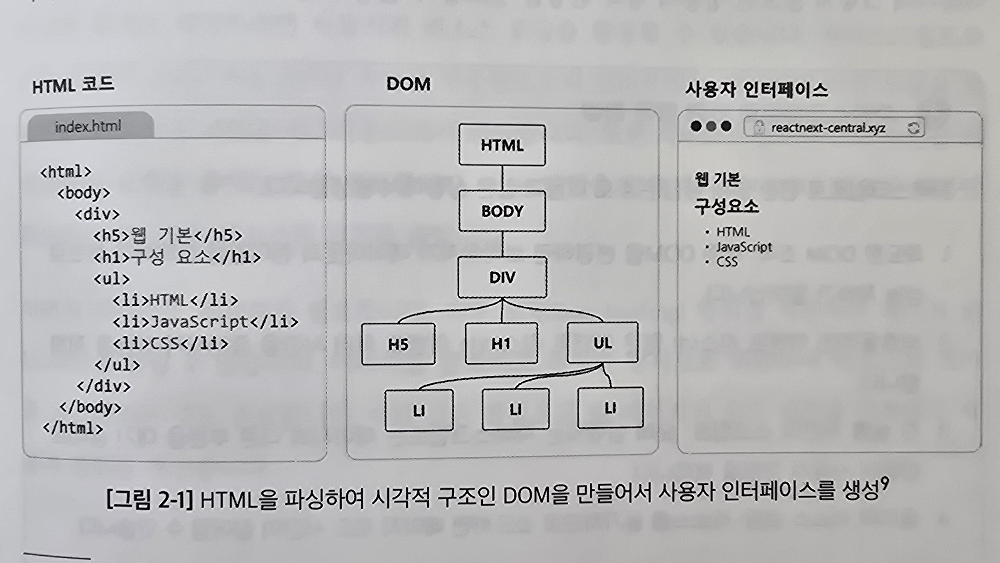

# 2.2 렌더링의 이해: 브라우저에서의 웹 페이지 렌더링 메커니즘

## 2.2.1 브라우저의 작동 원리

### 리소스 가져오기: HTML, CSS, JS, 이미지 및 멀티미디어, 폰트, 아이콘 등

URL 링크 입력 후 맨 처음 HTML 파일을 가져옴 
네트워킹 계층에서 진행되고 HTTP/HTTPS 프로토콜을 사용

### 파싱 및 구축

HTML 문자열을 DOM(Document Object Model)로 변환 
CSS도 파싱하여 CSSOM(CSS Object Model)으로 만듬 
CSSOM은 DOM요소가 시작적으로 어떻게 표현될지 정의함

### 조합 및 렌더링

DOM과 CSSOM을 결합해 렌더링 트리를 형성 

렌더링 트리는 페이지의 시각적 레이아웃을 나타내고 
CSS규칙에 따라 스타일이 지정된 모든 보이는 DOM요소를 포함함

렌더링 트리 구축 후 레이아웃 과정을 시작함 
화면에서 각 요소의 위치와 크기를 계산하는 것을 포함 

위 과정이 끝나면 화면에 요소를 그리기 시작하고 픽셀로 변환됨

### JS의 역할

동적 콘텐츠와 상호작용을 제공함 
JS로 인해 렌더링 파이프라인의 일부를 재계산 해야 할 수도 있음 
이로인해 성능의 병목 현상이 생길 수 있음

> **JS로 인한 병목현상** 
>
> 1. 과도한 DOM 조작 => 레이아웃과 렌더링을 반복 => 성능 저하
> 2. 비효율적인 이벤트 리스너: 많은 리벤트 리스너는 이벤트 처리 시간을 증가시킴 => 성능 저하
> 3. 실행 시간이 긴 스크립트: 긴 JS 실행은 페이지 다른 부분을 대기상태로 만듬
> 4. 동기적 리소스 로딩 => 페이지 로드 시간이 길어질 수 있음

### 웹 페이지 로딩 속도를 최적화하고자 개발자가 알아야 할 것: 리소스 관리 및 비동기 로딩 전략

웹 페이지 로딩 속도에 영향을 미치는 요소

- 리소스 로딩 방식 
  동기적인 로딩 방식보다 비동기적 로딩 방식을 사용하는게 좋음 
  js와 css의 `async`, `defer` 속성을 사용
- js와 css 파일의 최적화 => 용량 줄이기 or 파일을 압축 or 필요한 부분만 로드
- 이미지 최적화 
  지연로딩(lazy loading)을 사용해 페이지 로드시간을 줄일 수 있음 
  이미지를 압축 or 형식 변환을 통해 크기를 최소화

## 2.2.2 렌더링 트리 구성 이후: 리플로우, 리페인트

### 리플로우: 레이아웃 계산

리플로우(or 레이아웃) - 브라우저가 렌더링 트리의 요소 위치와 크기를 계산하는 과정

- 브라우저 창 크기를 변경
- 요소의 내용 변경 등

위와 같은 상황에서 리플로우가 발생

### 리페인트: 픽셀 색칠하기

레이아웃(리플로우) 단 계 후 리페인트 단계로 옮

화면의 일부 또는 전체를 다시 그리며 픽셀을 채우는 과정

- 색상
- 그림자

위와 같이 레이아웃에 영향을 주지 않는 것들의 변경으로 리페인트가 발생함

### 리액트와 가상 DOM을 활용한 효율적인 웹 애플리케이션 렌더링 전략

리액트는 UI를 구축하고자 가상 DOM을 사용하는데 
이는 효율적인 UI 업데이트와 렌더링을 최적화함

가상 DOM == DOM의 추상화 버전

상태 변경이 일어나면 리액트는 가상 DOM에 변경 사항을 적용하고  
실제 DOM과 비교해 필요한 최소한의 요소만 DOM에 실제 업데이트함

컴포넌트를 세분화하고 불필요한 렌더링을 방지해서 최적화 해라
