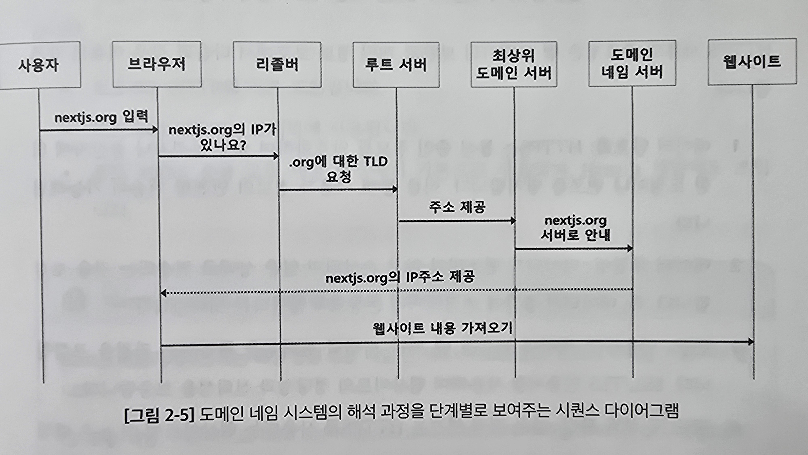

# 2.4 네트워킹 기초: 도메인, URL, 라우팅

도메인 - 웹사이트의 고유 주소를 제공 
URL, 라우팅 - 사용자를 특정 페이지나 리소스로 연결

## 2.4.1 도메인과 URL: 웹 리소스의 주소 체계

- 도메인(domain) 
  웹 사이트의 집 주소 
  사용자가 웹 사이트를 찾는데 도움을 줌 
  예) `nextjs.org`
- URL(Uniform Resource Locator) 
  집 안의 특정 방으로 가는 경로와 비슷함 
  웹 상에서 특정 리소스를 정하는데 상세한 정보를 제공 
  예) `https://nextjs.org/docs`
- 세그먼트(segment) 
  URL 내의 경로 부분을 세분화한 것으로 슬래시로 구분함 
  예) `https://nextjs.org/docs/installation` 에서 docs 와 installation
- 슬러그(slug) 
  URL의 마지막 부분으로 특정 페이지나 리소스를 나타내는 사람이 읽을 수 있는 키워드 
  예) `https://nextjs.org/docs/installation` 에서 installation

## 2.4.2 도메인 네임 시스템(DNS): 인터넷 주소 지정의 핵심

DNS는 웹사이트의 IP를 기억해야하는 문제를 해결해줌

**DNS의 작동 방식**

1. 사용자 요청 - 사용자가 브라우저에 도메인을 입력
2. 리졸버 쿼리 - 해당 도메인의 IP를 캐시에서 찾아봄, 없으면 DNS 리졸버에 요청
3. 루트 서버 - 리졸버는 루트 서버에 쿼리를 보냄  
   루트 서버는 최상위 도메인(Top-Level Domain, TLD) 서버(예: .com, .org)의 주소를 알려줌 
4. 최상위 도메인 서버 - 리졸버를 해당 도메인 네임 서버로 안내함
5. 도메인 네임 서버 - 도메인의 IP 주소를 제공
6. 연결 설정 - IP주소를 얻은 후 웹사이트 연결 시도

## 2.4.3 프로토콜과 포트: 웹 통신의 규칙과 접점

### 웹 통신에서의 프로토콜의 본질: HTTP와 HTTPS

프로토콜 - 데이터 교환을 원활하고 일관되게 진행하려는 합의된 규칙

- HTTP(HyperText Transfer Protocol) 
  웹 상의 모든 데이터 교환의 기반을 이루는 프로토콜 
  상태가 없는 프로토콜 == 각 요청은 이전 상호작용을 기억하지 않음
- HTTPS(HTTP Secure) 
  HTTP의 보안을 강화한 버전 
  SSL/TLS 프로토콜을 사용함

**HTTPS의 중요성**

- `데이터 암호화` 
  통신중인 정보를 암호화하여 도청이나 변호를 방지함
- `데이터 무결성` 
  데이터가 변조, 손상 되지 않고 전송되는 것을 보장함
- `인증` 
  사용자가 서버에 연결될 때 서버의 신뢰성을 확인하는 과정이 있음 
  SSL/TLS 인증서를 사용해 웹사이트의 정당성과 신뢰성을 보증함
- `SEO 및 랭킹 향상` 
  HTTPS 를 쓰면 검색엔진이 더 높은 랭킹을 부여함
- `사용자 신뢰 증진` 
  주소창에 '안전함'이라는 표시를 주고 보안이 적용된 사이트임을 인지할 수 있음

HTTPS 설정은 SSL/TLS 인증서를 획득하여 웹 서버에 설치하고 활성화하는 과정을 포함 
인증서는 웹사이트의 데이터를 암호화하고 안전성을 인증하기 위해 필요함 
설치 후 웹 서버의 SSL/TLS 설정을 조정하고 모든 HTTP 트래픽을 HTTPS로 리다이렉트하고자 443 포트를 설정함

### 포트

포트는 테으워크 내에서 서버가 특정 서비스를 제동하는 통신 지점을 식별하는 역할을 함 
서버에서 실행되는 서비스는 다른 포트를 사용해 외부 요청을 구분하고 처리함

기본 포트

- 80 : HTTP
- 443 : HTTPS
- 3000 : 종종 로컬 개발 환경에서 사용

## 2.4.4 라우팅 메커니즘: 웹에서의 경로 결정 및 데이터 전송 최적화

라우팅 - 사용자가 페이지와 뷰로 이동할 수 있도록 관리하는 과정 
사용자가 URL을 변경하면 라우팅 메커니즘이 해당 경로에 맞는 컴포넌트나 뷰를 렌더링함

라우트 - URL과 컨포넌트 간의 연결을 설정

### 정적 라우팅과 동적 라우팅: 라우팅의 두가지 유형

정적 라우팅 - 이미 정의된 일관된 라우트 
동적 라우트 - 런타임에 사용자의 랭동이나 특정 조건에 따라 결정되는 라우트 
예) `/product/[productId]`

### 효과적인 라우팅을 구현하는 전략들

- `중첩 라우팅` 
  계층 구조가 있는 페이지에 유용 
  예) 남성 의류 안에 티셔츠
- `라우트 가드` 
  특정 라우트를 보호하는데 필수적임 
  예) 관리자 패널은 인증된 사용자만 접근할 수 있어야함 
  Next.js 는 미들웨어와 경로 가로채기 기능을 제공
- `지연로딩, 코드 분할` 
  앱의 일부를 로딩하는데 도움을 주고 성능을 향상시킴 
  Next.js는 동적 임포트를 해 컴포넌트를 지연로딩하고 컴파일지 코드분할을 수행
- `폴백 라우트, 페이지미존재 라우트` 
  정의되지 않은 라우트를 처리하고 사용자가 길을 잃었을 때 필수적임 
  Next.js는 app/ 내에서 폴백하도록 `default.js`와 미존재 페이지를 `not-found.js` 파일을 생성해 관리할 수 있음
- `쿼리 매개 변수와 검색 최적화` 
  쿼리 매개변수를 사용해 검색 조건이나 선택 사항을 관리함
- `클라이언트 사이트 라우팅` 
  인터페이스 일부만 변경될 때 클라이언트 사이드 라우팅을 사용할 수 있음(SPA)
- `SEO 최적화` 
  의미 있는 URL, 적절한 메타 태그와 제목, 적적한 HTTP 상태코드 반환 등이  
  검색 엔진의 웹사이트 인덱싱에 영향을 미침
- `리다이렉트, URL 리라이트` 
  사이트의 구조 변경이나 오래된 URL을 새로운 URL로 매핑할 때 유용함 
  (여기서 리라이트는 포워딩을 말하는 듯)
- `국제화 및 지역화 지원` 
  다국어 지원을 위해 URL 경로에 언어 코드를 포함하거나 지역별 콘텐츠를 제공하는 라우팅 전략 가능
