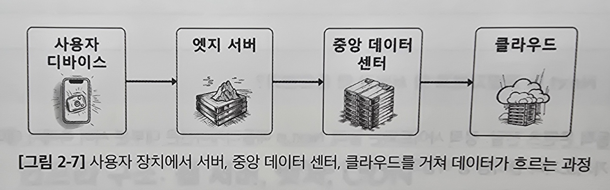

# 2.5 인프라 구조: 웹 서버, 엣지, CDN

웹 앱은 견고한 인프라스트럭처가 필요함 
인프라스트럭처는 웹 콘텐츠를 사용자에게 효과적으로 전달하고 속도와 신뢰성을 보장하는 역할을 함

## 2.5.1 웹 서버의 역할

### 웹 서버 이해하기

웹 서버 - HTTP 프로토콜을 통해 웹 페이지를 전송하는 소프트웨어

**웹 서버의 구성**

- 물리적 서버 - 서버 소프르퉤어가 실행되는 실제 하드웨어
- HTTP 서버 소프트웨어 - 요청을 디코딩 하고 응답하는 논리 처리(Apache, Nginx, Node.js...)

> **Next.js 개발자에게 웹 서버가 중요한 이유**
>
> - 동적 콘텐츠 전달 - SSR이나 서버 측에서 데이터 가져오기를 함
> - 향상된 성능 - 데이터 캐싱과 부하관리를 통해 콘텐츠를 빠르게 전달
> - 보안 관리 - SSL/TLS 를 통해 데이터 교환을 안전하게 보호
> - 세션 관리 - 세션관리를 통해 세션 간에 개인화된 사용자 경험을 제공

## 2.5.2 엣지 컴퓨팅과 CDN: 웹 성능 향상

엣지 컴퓨팅과 콘텐츠 전송 네트워크(Content Delivery Network, CDN)은 빠른 콘텐츠 전달을 도와줌 
이 기술들은 데이터의 원천에 가까운 곳에 컴퓨팅을 가져와 최소한의 지연 시간을 보장함

### 엣지 컴퓨팅: 주변에서의 힘

요즘은 엄청난 양의 데이터로 인해 중앙 집중식으로는 처리가 효율적이지 않음

`엣지 컴퓨팅` - 데이터가 발생하는 소스 근처에서 데이터를 처리하는 방식

**엣지 컴퓨팅의 장점**

- 지연 시간 감소 - 실시간에 가깝게 인사이트와 반응을 제공함
- 대역폭 효율 - 로컬에서 데이터를 처리하면 네트워크 대역폭의 부담을 줄임
- 신뢰성 - 중앙서버나 연결에 문제가 생겨도 로컬에서 데이터 처리는 계속 할 수 있음

### 콘텐츠 전송 네트워크: 전 세계적 엣지 인 배포, 지역적인 전달

`CDN` - 정적 웹 콘텐츠의 캐싱된 복사본을 저장하는 분산된 서버 네트워크 
사용자가 가장 가까운 서버에서 콘텐츠를 가져오도록 보장함

**CDN 구성요소**

- 원본 서버
- 엣지 서버

**CDN의 장점**

- 더 빠른 로딩 시간 - 근접한 엣지에서 콘텐츠를 전달하여 로딩 시간을 단축
- 대역폭 비용 감소 - 캐싱된 콘텐츠를 제공하여 데이터 비용을 줄임
- 증가한 가용성 - 하나의 서버가 실패해도 다른 서버가 대체할 수 있음

> **Next.js 에서 CDN 적용하기** 
> 버셀이 이미 전 세계적인 CDN과 통합되어 있음 => 버셀을 사용하면 됨
