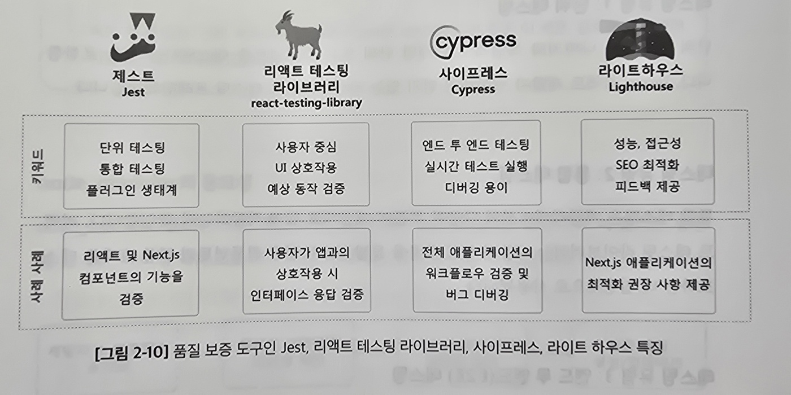

# 2.6 웹 개발의 필수 구성요소: 주숑 기술과 도구의 통합

## 2.6.1 웹 호스팅: Next.js 애플리케이션의 배포

웹 호스팅 - 웹 사이트에 저장 공간과 접근 권한을 제공하는 서비스

웹 호스트는 웹 사이트 파일이 저장되는 서버와 인터넷에서 웹사이트를 보게하는 기술과 서비스를 제공

- 서버: 웹 사이트를 호스팅하는 특수한 유형의 컴퓨터
- 도메인: 인터넷에서의 웹사이트 주소(예. naver.com)
- 웹 호스트: 서버 공간을 제공하는 회사

**다양한 호스팅 유형**

- 공유 호스팅: 여러 웹사이트가 하나의 서버를 공유
- 전용 호스팅: 단일 웹사이트가 전체 서버를 차지
- 가상 개인 서버(VPS) 호스팅: 웹 애플리케이션은 서버를 공유하지만 전용 리소스를 가짐
- 클라우드 호스팅: 리소스가 여러 서버들에 분산되어 확장성과 중복성을 제공
- 관리형 호스팅: 호스팅 업체가 서버를 관리하고 유지. 업데이트와 백업 포함

## 2.6.2 개발 환경 설정과 도구 선택

Visual Studio Code - 코드 에디터 
ESLint - 정적 코드 분석 도구 
Prettire - 코드 포매터 
리액트 개발자 도구 - 브라우저 확장 프로그램. 컴포넌트 구조와 상태 및 속성 정보 제공

## 2.6.3 패키지 관리와 의존성 관리

패키지 관리자 - 프로젝트 내의 의존성을 관리하고 패키지가 적절한 버전을 유지하도록 도움

### NPM(노드 패키지 관리자): 리액트 생태계의 표준

> `NPX`: 전역 설치 없이 바이너리나 명령을 실행 
> NPX는 NPM과 함께 번들로 제공되는 패키지 실행 도구임 
> 패키지 관리자는 아님.
>
> - 전역 설치 없이 실행 - `npx create-next-app my-app`
> - 로컬 바이너리 실행 - node_modules/.bin 폴더 내의 로컬 바이너리를 쉽게 실행
> - 다양한 패키지 버전 사용 - 버전을 지정하거나 직접 Git 저장소를 사용가능

### Yarn: 신뢰할 수 있는 대안

Yarn - 캐싱과 병렬화 및 직관적인 잠금 파일 메커니즘으로 빠르고 안전한 패키지 설치를 보장

> **NPM vs. Yarn** 
>
> - 성능 
>   Yarn의 캐싱과 병렬 가져오기로 인해 NPM보다 빠름 
>   npm v5 부터는 npm 성능이 향상되긴 했음.
> - 잠금 파일 - 둘 다 잠금 파일 사용(package-lock.json, yarn.lock)
> - 작업 영역 
>   Yarn은 멀티 패키지 구조를 관리하는 작업 영역 개념을 도입해  
>   monorepo 설정을 위한 즐겨찾기가 되어 있음
> - 명령어 차이 
>   npm => `npm install <package-name>` 
>   yarn => `yarn add <package-name>`
> - 무결성 - yarn은 코드 실행 전 설치된 패키지의 무결성을 확인해 설치가 안전하며 조작되지 않았음을 보장함
> - 플러그 앤드 플레이 
>   Yarn은 mode_modules 폴더를 제거하고자 플러그 앤드 플레이를 도입해 
>   항상 올바른 패키지에 액세스하게 하고 node_modules 해결이 필요 없음

### PNPM: 효율성 및 업격한 종속성 해결에 중점을 둔 대안

PNPM == 성능이 우수한 npm 
대안적인 패키지 관리자로 종속성을 관리하고 저장할 때 기존과 다른 접근 방식을 사용함

- 효율적인 저장 
  모든 프로젝트마다 종속성을 중복 저장하는 대신 
  공유 콘텐츠 주소 가능 저장소를 사용함 => 설치 속도 향상, 디스크 공간 절약 
  > 하드 링크, 심볼릭 링크를 활용
- 엄격한 종속성 연결 
  패키지가 명시적으로 나열한 종속성만 접근하게해 빌드 신뢰성 향상
- 모노 레포 지원 
  모노 레포를 관리하는 기본 지원 제공

### node_modules의 중요성

해당 폴더는 모든 패키지와 의존성이 위치하는 폴더임

### 의존성 관리 및 업데이트

패키지를 최신 상태로 유지하는 것은 보안 및 성능에서 중요함

## 2.6.4 애플리케이션 테스팅과 품질 보증의 중요성

테스팅은 앱이 다양한 조건에서 예상대로 작동하는지 확인

### 테스팅 유형 1: 단위 테스팅

개별 단위 또는 컴포넌트를 테스팅하는 것

`Jest` 많이 씀

### 테스팅 유형 2: 통합 테스팅

앱의 다양한 부분이 예상대로 함계 작동하는지 확인

리액트 테스팅 라이브러리 많이씀 
사용자 상호작용을 모방하고 다양한 컴포넌트의 결합 효과를 테스트

### 테스팅 유형 3: 엔드 투 엔드(E2E) 테스팅

사용자처럼 앱의 흐름을 시작부터 끝까지 테스트

사이프레스(Cypress) 많이 씀

사용자 로그인 => 다양한 페이지 탐색 => 로그아웃 하는 과정을 스크립트화하여 테스트 함

---

라이트하우스(Lighthouse) - 구글의 도구로 성능, 접근성, 검색엔진 최적화에 대한 테스팅 지원

