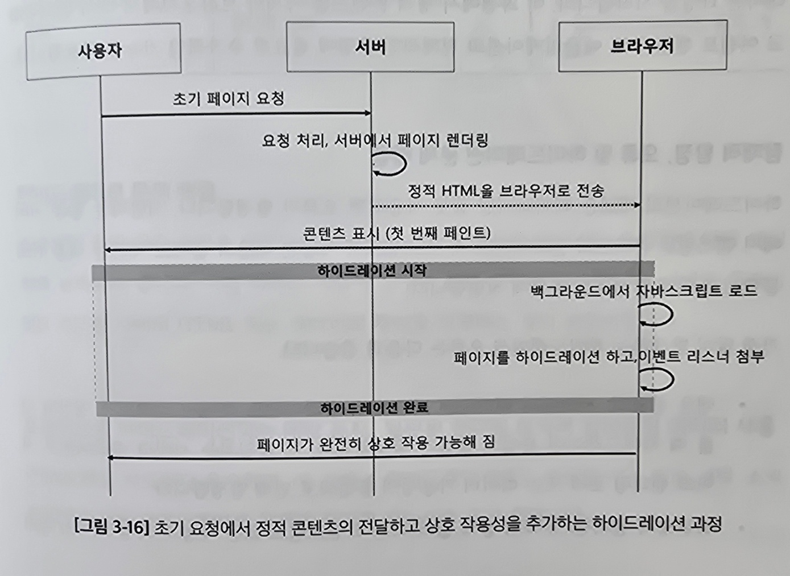

# 3.1 Next.js 렝더링의 신세계: SSR, CSR, 하이드레이션, 웹 스트리밍

## 3.1.1 전통적 웹 렌더링 방식

옛날 방식을 알면 요즘 것들 이해하기 쉬움

### SSR 이해하기

서버가 각 페이지 요청에 대한 모든 데이터를 처리하고 바로 렌더링 할 수 있는 페이지를 클라이언트에 반환하는 기법

SEO에 유리, 크롤러 페이지의 전체 스냅숏을 제공함

요청마다 새 페이지를 생성해서 리소스를 많이 사용할 수 있음 
트래픽이 높으면 로드시간이 늘어남

### CSR 살펴보기

최소한의 HTML 만 전송하고 렌더링 작업을 클라이언트의 브라우저에서 하는 기법

콘텐츠 변경이 빨라 동적인 사용자 경험이 좋음

모든 자바스크립트 파일을 받아야해서 초기 로드시간이 김 
SEO에 좋지 않음

### SSG의 잠재력 발굴

빌드 시 라우트에 대한 정적 HTML을 미리 생성해 페이지를 서버가 렌더링 없이 바로 전달하는 기법

빠른 페이지 로딩, 서버 부담 감소

동적인 콘텐츠에는 적합하지 않음

| 페이지 유형     | 적합한 방법 | 이유                               |
| :-------------- | :---------- | :--------------------------------- |
| 블로그 글       | SSG         | 콘텐츠 변경 적고, 속도 및 SEO 중요 |
| 제품 페이지     | SSR         | 실시간 정보 필요, SEO 중요         |
| 사용자 대시보드 | CSR         | 동적 데이터, 실시간 상호 작용 필요 |
| 이벤트 캘린더   | SSG         | 콘텐츠 변경 적고, 빠른 로딩 필요   |
| 실시간 피드     | SSR         | 실시간 데이터 필수, 자주 변경      |
| 인터랙티브 게임 | CSR         | 실시간 상호 작용, SEO 불필요       |

## 3.1.2 서버 및 클라이언트 컴포넌트의 결합을 통한 하이브리드 렌더링 전략

하이브리드 렌더링 - 서버 컴포넌트와 클라이언트 컴포넌트를 구분하여 접근하는 전략

### 서버 렌더링 소개

서버 렌더링 - 하이브리드 모델의 핵심 
서버에서 콘텐츠를 먼저 렌더링하고 클라이언트로 HTML을 전송 
브라우저에서 js를 활용한 하이드레이션을 거쳐 최종 렌더링됨

Next.js의 서버 렌더링은 데이터 캐싱 방식에 따라 구분됨

- 정적 렌더링 
  ISR을 사용해 데이터를 주기적으로 새로 고침하여 캐싱 
  SSG처럼 미리 렌더링된 페이지를 제공
- 동적 렌더링 
  SSR 방식 
  사용자 요청에 따라 데이터를 생성해 요청된 페이지를 렌더링해 제공
- 서스펜스 스트리밍 
  요청 시 데이터를 생성하는 방식 
  서스펜스와 함께 로딩을 보여주고  
  데이터를 생성한 컴포넌트부터 병렬적으로 전송하는 방식

### 클라이언트 렌더링

클라이언트 렌더링 - 브라우저에서 js를 사용해 콘텐츠를 렌더링하는 방식

페이지 내용이 사용자 상호작용에 따라 동적으로 변하는 SPA에 중요함

### Next.js의 융합된 렌더링 전략: 유연성과 성능을 위한 접근

하이브리드 렌더링 모델은 개발자에게 유연성을 제공함

빠른 성능과 개선된 SEO에 대해 동적인 사용자 상호작용을 가능하게 함

## 3.1.3 데이터 변경에 따른 증분적 정적 재생성을 통한 정적 렌더링

정적 렌더링의 원래 의미 - 고정된 콘텐츠 
=> 상호 작용성과 실시간 반응성 면에서 한계

#### Next.js 의 정적 렌더링 해석

- HTML이 사용자에게 도달하기 전에 미리 렌더링
- 정적 콘텐츠를 필요에 따라 재검증하고 재생성하는 능력

`ISR`은 정적 렌더링의 유연성을 보여주는 Next.js 기능 

> `ISR`을 사용하면 배포 후 정적 콘텐츠를 업데이트 할 수 있음 
> => 모든 변경 사항에 대해 사이트를 다시 빌드할 필요가 없음

### 정적 렌더링과 SEO: 조화로운 연합

정적 렌더링은 SEO에 긍정적인 영향을 줌

> 검색 엔진은 빠르고 반응성이 뛰어난 사이트를 선호함 
> => 사전에 렌더링한 콘텐츠는 바로 줄 수 있어서 만족시킬 수 있음

SSG의 특성은 미리 렌더링한 콘텐츠가 검색엔진이 콘텐츠를 불러왔을 때 
바로 색인 가능하게 만들어 콘텐츠를 검색하기 쉽고 검색 결과에서 더 높은 순위를 차지하게 함

### 정적 렌더링: 만능 해결책이 아님

콘텐츠가 예측 가능하고 일관되면 유용하지만 
매우 동적이고 사용자 특정 콘텐츠에서는 문제가 됨

## 3.1.4 실시간 요청에 대응하는 동적 렌더링 방식

동적 렌더링 - 사용자 요청에 즉시 콘텐츠를 생성하는 것 
콘텐츠가 자주 변경 || 데이터 변동성이 큼 || 사용자를 특정해 미리 렌더링 할 수 없는 경우 적합

사용자에게 즉각적인 데이터 및 개인화된 콘텐츠를 제공함 
=> 사용자 경험 향상

> #### 동적 렌더링의 장점을 활용할 수 있는 사이트
>
> 소셜 미디어 피드, 실시간 스포츠 점수 표시, 실시간 예약 시스템, 
> 주식 거래 플랫폼, 전자상거래 스토어 등등

#### 동적 렌더링과 정적 렌더링에 적합한 시나리오 비교

| 웹 구성 요소  | 렌더링 적합성  | 이유                                                   |
| :------------ | :------------- | :----------------------------------------------------- |
| 사용자 댓글   | 동적           | 실시간 상호 작용 및 지속적인 콘텐츠 추가 필요성        |
| 실시간 피드   | 동적           | 지속적인 실시간 정보 업데이트 필요성                   |
| 정적 기사     | 정적           | 변경 없이 성능을 최적화하는 사전 렌더링 기능           |
| 사용자 프로필 | 동적/정적 혼합 | 공개 정보는 정적; 개인정보는 동적 처리 필요            |
| 제품 목록     | 정적/동적 혼합 | 기본정보는 정적; 가격 및 재고 같은 동적 정보 변화 필요 |
| 블로그 게시물 | 정적           | 드문 업데이트로 인한 SSG 이점 활용                     |
| 이벤트 캘린더 | 동적           | 자주 변경되는 이벤트 정보 반영 필요                    |
| 포럼          | 동적           | 상호 작용 및 지속적 콘텐츠 생성 필요                   |

### 동적 렌더링의 도전 과제

서버에서 복잡한 계산이 필요하면 정적 렌더링보다 페이지 로딩 시간이 느림 
=> 서버 응답 캐싱 또는 증분적 정적 재생성 등의 전략을 사용

### 동적 렌더링: 도구일 뿐 만병통치약이 아님

완벽한 해결책이 아니니 SSG와 잘 섞어 써라

## 3.1.5 로딩 UI를 동반한 서스펜스 스트리밍

사용자 경험이 중요함. 사용자는 콘텐츠와 상호작용하고 즉각적인 것을 좋아함
=> 서스펜스 스트리밍 기능이 주목받음

서스펜스 - 컴포넌트가 렌더링 되기까지의 로딩을 처리 
스트리밍 - 데이터를 연속적으로 전송하는 과정

서스펜스 스트리밍 - 서버에서 콘텐츠를 렌더링할 동안 로딩 상태를 관리하는 기술

사용자가 전체 페이지 로딩을 기다리지 않아도 중요한 콘텐츠를 빠르게 볼 수 있음

> | 서스펜스를 사용하지 않을 때 |                  |
> | --------------------------- | ---------------- |
> |             |  |
>
> 서스펜스를 사용하지 않으면 서버가 모든 데이터를 수집하는 시간고 렌더링하는 시간을 기다려야함

| 서스펜스 스트리밍 사용 |                  |
| ---------------------- | ---------------- |
|        |  |

컴포넌트 단위로 청크를 분할해 우선순위에 따라 전송함 
렌더링 지연을 줄이고 TTFB, FCP, TTI 모두 개선 가능

### 사용자 경험 향상: 사용자 인지력 향상과 상호작용 최적화

웹에서는 몇 초의 지연이 사용자 이탈로 이어짐 
그래서 사용자의 인지를 관리해주는 것이 중요함

데이터 로딩이 많은 대시보드 같은 곳에서는 서스펜스 스트리밍이 좋음

데이터가 순차적으로 스트리밍 되면서 사용자는 이미 로드된 부분과 상호작요하며 대기 시간을 덜 느낌

### 데이터 가져오기와의 통합

서스펜스는 데이터 가져오기 작업을 원활하게 처리하는데 사용됨 
데이터 가져오기 라이브러리와 잘 통합됨

데이터 가져오기가 시작되면 해당 데이터에 의존하는 컴포넌트 대시 대체 UI를 보여줌 
데이터 로드가 끝나면 해당 컴포넌트가 데이터를 반영하여 렌더링됨 
=> 사용자에게 데이터 로딩 중임을 알리고 사용자 경험 중단을 최소화함

> #### 전통적 데이터 가져오기 방식과 서스펜스 스트리밍 비교
>
> | 파라미터      | 전통적 데이터 가져오기                                          | 서스펜스 스트리밍                                              |
> | :------------ | :-------------------------------------------------------------- | :------------------------------------------------------------- |
> | 페칭 메커니즘 | 컴포넌트 내에서 직접 AJAX 호출 or 생멍 주기 메서드 사용         | 서스펜스의 `<Suspense>` 래퍼 및 `React.lazy`를 사용한 지연로딩 |
> | 로딩 처리     | 데이터 존재에 대한 명시적조건 확인 - 수동 로딩 표시자           | 데이터/컴포넌트가 준비될 때까지 자동으로 폴백 UI 표시          |
> | 오류 처리     | 데이터 페칭 호출 주변에 `try-catch`블록 사용 - 수동 오류 메시지 | 자동 오류 UI를 표시하는 에러 경계와 결합                       |
> | 성능          | 복잡한 컴포넌트에서 여러 렌더링의 위험                          | 불필요한 렌더링 감소를 통한 동시 모드로 최적화                 |
> | 가독성        | UI 및 데이터 페칭 코드가 꼬여 복잡한 논리                       | 데이터 로딩과 컴포넌트 렌더링을 분리해 모듈화되고 명확함       |

### 모범사례와 흔한 함정

> #### 서스펜스 모범사례 - 해야할 것
>
> 1. 적절한 폴백 사용 
>    사용자가 빈 화면을 볼 일 없게 만들기
> 2. 오류처리 
>    컴포넌트 트리 여러 레벨에서 에러 경계 구현
> 3. 코드 분할 
>    필요한 때만 컴포넌트를 로딩하고 스트리밍하는데 도움이 됨
> 4. 서버 최적화 
>    서버가 스트리밍을 지원하도록 하고 우선순위가 높은 콘텐츠를 먼저 보낼 수 있도록 최적화
> 5. 테스트 
>    서스펜스와 스트리밍을 사용하면 동시성 문제가 발생할 수 있음 
>    다양한 조건에서 테스트 해봐야함

> #### 서스펜스 - 하지 말아야 할 것
>
> 1. 서스펜스 남용 
>    모든 컴포넌트에 사용하면 복잡하고 관리만 어려워짐 
>    데이터를 가져오는 컴포넌트에만 사용하면 됨
> 2. 로딩 상태 무시하지 않기 
>    서스펜스를 사용해서 콘텐츠 로딩시간은 있음
> 3. 데이터 페칭 방법 혼합하지 않기 
>    데이터 페칭 서스펜스를 사용할 때 `componentDidMount`같은 전통적인 데이터 페칭 방법과 혼합하면 
>    일관성 없는 동작을 발생시킬 수 있음
> 4. 서버 오류 무시하지 않기 
>    서버 오류를 잘 처리하도록 해야함 
>    컴포넌트가 무기한 일시 중단될 수 있음
> 5. SEO 잊지 않기 
>    검색 엔진 봇이 웹페이지를 보는 방식에 영향을 미치기 때문에 
>    초기 렌더링에 의미 있는 콘텐츠가 포함되어있어야함

### 오류 우아하게 처리하기

리액트의 에러 경계는 렌더링에 실패한 컴포넌트에 대한 대체 UI를 제공함

## 3.1.6 리액트 기반 클라이언트 렌더링 기법

웹 초기에는 SSR이 주요 역할을 함 
하지만 CSR 등장으로 패러다임이 바뀜

CSR은 브라우저를 동적이고 풍부한 경험을 제공하는 플랫폼으로 변화시킴

다음 그림은 가상 DOM을 사용하여 실제 DOM에 반영되는 과정을 나타냄

### 사용자 상호작용에서 리액트 클라이언트 컴포넌트의 우세

리액트 컴포넌트는 실시간 업데이트, 인터랙티브 폼, 정교한 애니메이션 등  
복잡한 기능을 지원하며 웹 사용자 인터페이스의 가능성을 확장합니다.

`하이드레이션(hydration)` 
서버에서 HTML이 초기 렌더링되는것을 보장한 후  
상호작용 가능한 클라이언트 사이드 리액트 애플리케이션으로 전환하는 것

### 상태관리와 훅: 리액트의 강점

상호 작용이 많은 애플리케이션에서 상태관리는 필수적임 
리액트는 훅을 통해 함수형 컴포넌트 내에서 상태와 사이드 이펙트를 효율적으로 관리 방법을 제공

### 코드 분할과 레이지 로딩을 통한 성능 최적화

Next.js 는 코드를 작은 청크로 분할해 보고있는 페이지에 필요한 코드만 전달

리액트의 지연 로딩은 컴포넌트가 필요할 때만 로드됨 => 초기 로드시간 줆

## 3.1.7 하이드레이션 메커니즘의 이해와 실용적 주의사항

### 하이드레이션의 개념과 그 중요성

SSR을 통해 받은 페이지는 정적인 버전임 
빠르게 로드되지만 상호작용 기능이 부족함

하이드레이션을 통해 상호작용을 가능하게 함

### 왜 하이드레이션인가?

1. 빠른 첫 화면 표시를 보장하고 상호작용성을 유지해 사용자 경험이 풍부해짐
2. 콘텐츠 접근성을 우선시하면서 점진적으로 고급 기능을 추가하는 프로그레시브 향상 원칙을 따름

### 하이드레이션 작동원리

정적 콘텐츠를 서버에서 받고 렌더링 하면서 
이벤트 핸들러, 운영에 필요한 추가적인 기능을 적용함

### 잠재적 함정, 오류 및 하이드레이션 문제 해결

서버에서 렌더링된 콘텐츠와 클라이언트 측 스크립트가 예산한 내용과의 불일치 문제

#### 가장 많이 발생하는 하이드레이션 오류

- 내용 불일치 
  서버에서 렌더링된 HTML이 클라이언트 측에서 예상한 것과 다를 때 
  서버와 클라이언트 사이의 렌덜이 로직 또는 데이터 사용성의 불일치가 원인
- 비결정적 렌더링 
  무작위 값, 다른 타임스템프, 사용자 특정 데이터 등 
  클라이언트와 서버에서 콘텐츠가 다르게 렌더링되게하면 발생

> **하이드레이션 불일치 원인과 해결책**
> | 시나리오 | 영향 | 해결책 |
> | :--- | :--- | :--- |
> | 비결정적 렌더링 | 서버/클라이언트 간 렌더링 결과 불일치 | 렌더링 경호 결정적으로 설정, 무작위 함수 사용 피하기 |
> | 환경 데이터 차이 | 서버/클라이언트 환경 정보 불일치 | 브라우저 특정 객체 직접 참조 피하고 조건부 렌더링 사용 |
> | 서버/클라이언트 사이드 useEffect 훅 | 서버 또는 클라이언트에서만 발생하는 useEffect 훅 | 사이드 이펙트 일관성 유지, 적절한 생명 주기 메서드/훅에서 실행 |
> | 오래된 서버 데이터 | 서버의 캐싱된 데이터가 오래됨 | 서버 데이터 최신화 전략사용, 실시간 데이터는 클라이언트에서 가져오기 |
> | CSS 불일치 | 서버/클라이언트에서 CSS 처리 방식 차이 | 스타일 일관된 로딩/적용 방식 확립 |
> | 조건부 렌더링 오류 | 서버/클라이언트 조건부 렌더링 차이 | 렌더링 조건 일관성 확인, UI 조건 로직 검토 |
> | 서드 파티 라이브러리 문제 | SSR 비호환 라이브러리 사용으로 인한 렌더링 차이 | SSR 지원 라이브러리 사용 또는 클라이언트에서만 동적 가져오기 |

### 하이드레이션 문제 해결

불일치를 없애야함 
리액트 개발자 도구나 로깅 도구 잘 써야됨

### 효과적으로 하이드레이션 하는 예방 조치: 일관된 렌더링 로직과 결정론적 데이터 사용

조건문, 삽입된 데이터, 컴포넌트의 순서를 세부적으로 확인

기능 플래그나 환경 변수를 쓸 때는 양쪽 모두에서 불일치를 방지하도록 함

렌더링 과정에서 사용되는 데이터는 결정론적이어야함 
같은 초기 상태와 입력 조건이 주어지면 같은 출력이 나와야함

사용자 특정 데이터, 시간에 민감한 데이터, 임의값 등이 데이터를 비결정론적으로 만듦

### 테스팅과 품질 보증

테스팅은 배포 전에 잠재적인 문제를 발견할 수도 있음

- 단위 테스트 : 개별 컴포넌트 테스트
- 통합 테스팅 : 컴포넌트 간 상호작용 테스트
- 엔드투엔드 테스트 : 애플리케이션 전체 테스트

### 성능 고려 사항

클라이언트에 전송되는 js의 양 최적화 
코드 분할 및 중요 상호작용 우선

---

> #### 일관된 렌더링을 유지하기위한 가이드
>
> - 결정론적 렌더링 함수
> - 환경에 구애받지 않는 컴포넌트
> - 데이터 가져오기의 일관성
> - 오류 경계 처리
> - 일관된 컴포넌트 상태
> - 조건부 렌더링 주의
> - 라이브러리 현명하게 사용
> - CSS 일관성 유지
> - 테스팅 및 검증
> - 로깅 및 모니터링
> - 클라이언트에서 하이드레이션
