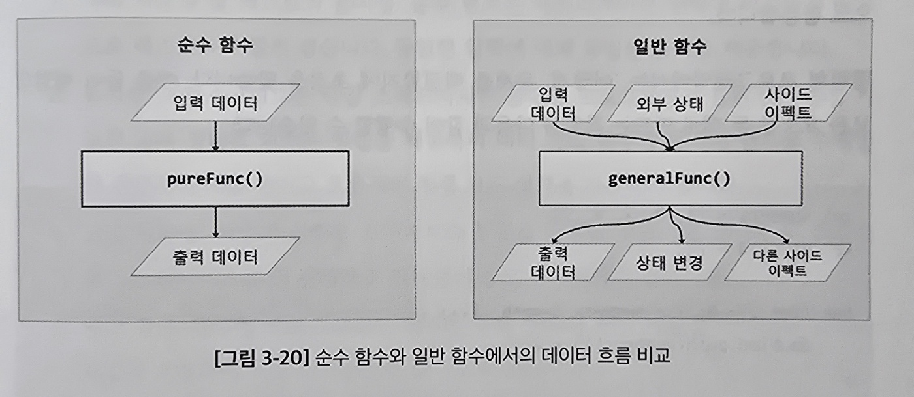

# 3.2 코드 유지 보수성의 탁월함: 모듈화와 함수형 프로그램밍 접근 방식

요즘은 깔끔하고 유지보수하기 좋고 확장성 좋은 코드가 중요함

모듈화와 함수형 프로그램밍을 사용하면 좋음

## 3.2.1 모듈화 방식: 패턴과 모범 사례

모듈화 - 소프트웨어 애플리케이션을 독립적인 모듈로 분리하는 과정

각 모듈은 애플리케이션의 기능성 일부를 담당

이는 관심사를 분리하고 코드 재사용성을 증진함

#### 단일 구조와 모듈화 간의 차이점

- 단일 구조(Monolithic) 아키텍처<br>
  기능들이 얽혀있고 코드 베이스 관리 어려움
- 모듈식 아키텍처<br>
  기능이 모듈별로 분리되어 정의됨<br>
  잘 정의된 인터페이스를 통해 상호 연결됨

#### 모듈화 시 같이 하면 좋은 방법론

1. **단일 책임 원칙**<br>
   디버깅과 테스팅을 단순화 하는데 도움이 됨
2. **일관된 명명 규칙**<br>
   가독성과 예측 가능성 향상
3. **폴더 구조**<br>
   기능에 따라 관련 파일을 조직화함
4. **문서화**<br>
   기능, 인터페이스, 다른 부분과의 상호작용에 대해 문서화
5. **컴포넌트 재사용성**<br>
   재사용할 수 있는 컴포넌트를 만듦
6. 명확한 프로젝트 구조<br>
   파일과 폴더를 기능적으로 분리 구성<br>
   => 앱의 모듈성을 반영하고 코드 베이스를 쉽게 탐색하게 됨
7. 관심사 분리<br>
   UI 컴포넌트에서 로직를 격리하고 상태를 효과적으로 관리

### 모듈화 애플리케이션의 계층 구조

모듈 - 기능을 그룹화하여 재사용 가능하게 하는 독립적인 파일단위<br>
`export`와 `import`를 통해 외부로 내보내고 다른 모듈에서 사용함

이 구조는 애플리케이션의 유연성, 확장성 및 유지보수성을 향상시킴

### JS 에서의 모듈

ES6 모듈 시스템에서는 각 파일을 모듈로 간주<br>
모듈은 자신만의 스코프를 가지고 모듈 바깥에서 접근할 수 없음

#### 모듈의 종류

- Named Export
  ```js
  // utils.js
  export function add(a, b) {
    return a + b;
  }
  export function substract(a, b) {
    return a - b;
  }
  // other.js
  import { add, substract } from "utils.js";
  ```
- Default Export

  ```js
  // Greeting.jsx
  import React from "react";

  function Greeting({ name }) {
    return <div>Hello! {name}</div>;
  }

  //app.jsx
  import React from "react";
  import Greeting from "./Greeing";
  import { add, substract } from "./utils.js";

  function App() {
    const totla = add(2, 3);
    return (
      <div>
        <h1>Sym is: {totla}</h1>
        <Greeting name="John" />
      </div>
    );
  }
  ```

## 3.2.2 함수형 프로그래밍: 핵심 원리와 이점

**함수형 프로그래밍(Functional Programming, FP)**<br>
계산을 수학 함수의 평가로 취급하고 상태 변경 및 가변 데이터를 피하는 프로그래밍 패러다임

### 함수형 프로그래밍의 핵심 개념

함수를 명령형 문장의 순서가 아닌 값으로 반환되는 표현식으로 봄



#### 핵심 개념

1. 불변성: 데이터 구조가 한번 생성되면 변경할 수 없음
2. 순수 함수: 출력값은 입력값에 의해서 결정됨
3. 함수 조합: 여러 함수를 결합해 새로운 함수를 생성함
4. 일급 및 고차함수: 함수를 일급 객체로 취급(할당, 인수로 전달 가능)
5. 재귀 함수: 재귀함수에 크게 의존함

### 선언형 코드 우선

선언형 코드?<br>
값으로 반환되는 표현식들의 집합으로 함수를 정의

명령형은 '어떻게' 문제를 해결할지에 초점<br>
선언형은 '무엇을' 해결할지에 초점

```js
//명령형 예
let numbers = [1, 2, 3, 4, 5];
let doubled = [];

for (let i = 0; i < numbers.length; i++) {
  doubled.push(numbers[i] * 2);
}

console.log(doubled);
```

```js
// 선언형 예
let numbers = [1, 2, 3, 4, 5];
let doubled = numbers.map((number) => number * 2);

console.log(doubled);
```

### Next.js 에서 함수형 프로그래밍을 사용하는 이점

1. 예측 가능성 및 테스트의 용이성<br>
   > 순수 함수는 애플리케이션 상태에 의존하지 않아 테스트 쉬움<br>
   > 동일 입력 동일 출력을 제공
2. 동시성<br>
   > 불변성을 통해 동시성 문제를 줄이고 효율적인 병렬 코드 실행 가능하게 함
3. 코드 명확성<br>
   > 간결하고 가독성이 좋음
4. 버그 감소<br>
5. 성능 향상<br>
   > 지연 평가 등을 활용해 성능을 향상

### Next.js 애플리케이션에 함수형 프로그래밍 통합

- 함수형 컴포넌트 사용
- 상태 관리<br>
- 이펙트 훅 사용<br>
- 데이터 가져오기<br>
