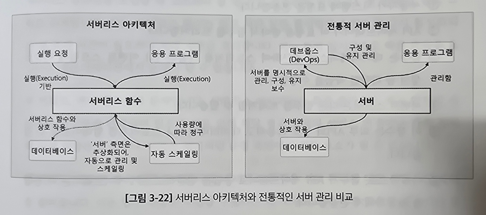
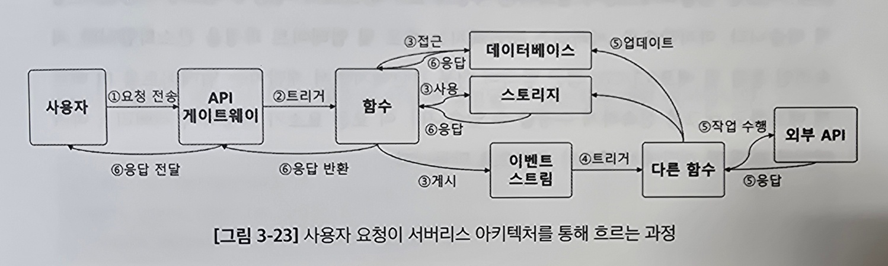
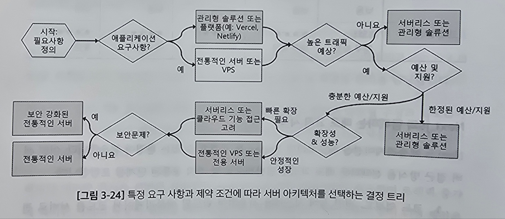

# 3.3 배포 및 운영 최적화 전략: 서버 아키텍처의 다양한 옵션

## 3.3.1 서버리스 아키텍처의 이해: 주요 구성 요소와 장단점

서버리스 컴퓨팅 - 서버 관리를 추상화해 개발자에게서 분리하는 개념<br>

- 개발자가 인프라에 대한 걱정없이 개발과 운영에 집중 할 수 있게됨
- 사용한 컴퓨팅 시간만 비용 지불하는 구조여서 효율적임



#### 서버리스 아키텍처의 구성요소

- `서비스형 함수(Functions-as-a-Service, FaaS)`<br>
  서버리스 아키텍처의 기본<br>
  앱 기능을 독립적인 함수로 배포<br>
  함수의 스케일링은 클라우드 제공자가 관리
- `서비스형 백엔드(Backend-as-a-Service)`<br>
  인증, DB, 파일 저장소 등의 서비스를 외부 제공 업체가 관리함<br>
  전통적인 백엔드 서버의 필요성이 감소하고 프론트엔드와 직접 통합됨
- `API 게이트웨이`<br>
  HTTP 요청을 처리하고 적절한 함수나 서비스로 라우팅하는 역할(진입점)
- `이벤트 트리거`<br>
  상태 변경이나 데이터 업데이트가 함수를 실행<br>
  동적이고 반응적인 앱을 가능하게 하는 트리거 역할



### 서버리스 아키텍처의 이점

1. **운영 비용 감소**<br>
   서버를 직접 관리하지 않아서 개발자는 개발에 집중 가능
2. **비용 효율성**<br>
   사용량 기반으로 비용을 지불해 불필요한 비용 절감
3. **확장성과 유연성**<br>
   서비스 확장이 쉽고 복잡한 서버 환경 설정에 대한 걱정이 없음<br>
   트래픽 변화에 빠르게 적응 가능
4. **배포, 업데이터 과정이 간소함**<br>
   CI/CD 가 더 간단해짐

### 서버리스 아키텍처 도입 시 고려 사항

1. **콜드 스타트 문제**<br>
   서버리스 함수가 일정 시간 활성화되지 않으면<br>
   다시 활성화 되는데 추가 시간이 필요함
2. **벤더 종속성**<br>
   특정 클라우드 업체의 서비스와 밀접하므로 <br>
   제공업체의 서비스 변경이나 가격 정책에 큰 영향을 받음
3. **제한된 제어 권한 문제**<br>
   서버리스는 서버 관리에 대한 직접적인 제어를 줄여주지만<br>
   일부 복잡한 작업을 수행하는 데 제약이 될 수 있음
4. **디버깅과 모니터링 어려움**<br>
   디버깅과 모니터링을 위해 새로운 전략이나 도구를 개발하고 적용해야 할 수 있음

### Next.js 와 서버리스

Next.js의 구조는 애플리케이션을 람다 함수처럼 개별적으로 분할하고 독립적으로 배포하는데 도움을 줌(API 라우트)

Next.js 의 API 핸들러는 함수를 API 게이트웨이 뒤에 쉽게 배포 가능<br>
=> 서버리스 Next.js 애플리케이션의 구축과 설정을 간소화

```js
// 서버리스 함수 예시
// app/api/hello/route.js
export async function GET() {
  return Response.json({ text: "Hello" });
}
// /api/hello 엔드포인트에서 독립적으로 배포될 수 있는 서버리스 함수
```

## 3.3.2 전통적 서버 기반 아키텍처: 특징과 선택 기준

### 전통적인 서버 기반 아키텍처 이해하기

서버 기반 아키텍처 - 웹 애플리케이션을 호스팅하는 전용 서버를 포함<br>
개발자는 서버 리소스, 업데이트, 보안 및 확장성 관리 담당

#### 장점

- 사용자가 서버 환경을 제어해 맞춤형 구성과 최적화가 가능함
- 예측 가능한 비용을 제공하고 전용 리소스 사용으로 일관된 성능 보장

#### 단점

- 서버의 지속적인 유지보수와 보안 업데이트 필요
- 트래픽 증가에 대한 서버 확장이 필요할 때가 있음
- 물리적 서버 구매나 장기 VPS 계약은 상당한 초기 투자 비용이 필요

### 서버 기반 아키텍처 유형

1. 전용서버<br>
   하나의 애플리케이션 || 회사 전용의 물리적 서버<br>
   강력한 성능과 보안 제공
2. 가상 개인 서버(VPS)<br>
   인터넷 호스팅 서비스에서 제공하는 가상 머신<br>
   비용, 제어, 성능 사이의 균형을 맞추는데 유용
3. 공유 호스팅<br>
   한 서버에 여러 애플리케이션이 리소스를 공유<br>
   트랙픽 요구가 낮은 사이트에 적합
4. 코로케이션<br>높음
   자체 물리적 서버를 3자가 운영하는 데이터 센터에 두는 것<br>
   우수한 인프라를 활용하면서 서버 하드웨어에 대한 완전한 제어를 유지

| 서버 유형           | 비용      | 성능      | 제어        | 보안      | 확장성 |
| :------------------ | :-------- | :-------- | :---------- | :-------- | :----- |
| 전용서버            | 높음      | 매우 높음 | 완전한 제어 | 매우 높음 | 보통   |
| 가상 개인 서버(VPS) | 보통      | 높음      | 좋은 제어   | 높음      | 좋음   |
| 공유 호스팅         | 낮음      | 낮음      | 제한됨      | 보통      | 낮음   |
| 코로케이션          | 매우 높음 | 매우 높음 | 완전한 제어 | 매우 높음 | 좋음   |

### Next.js 와 함께하는 배포 고려 사항

Next.js 앱을 배포하려면 Node.js 를 실행할 수 있는 환경이어야 함

#### 배포 단계

1. 코드 업로드
2. 의존성 설치 - `npm install`
3. 앱 시작 - `npm run start`
4. 리버스 프록시 설정<br>
   들어오는 트래픽을 Next.js 앱으로 연결하고나 Nginx와 같은 리버스 프록시를 구성
5. SSL/TLS 구성<br>
   HTTPS 용 SSL/TLS 인증서를 설정해 앱을 보호
6. 모니터링<br>
   성능과 가동 시간을 추적하는 로깅 및 모니터링 솔루션 구현

### Next.js 앱에 맞는 선택 찾아가기

#### 고려사항

1. 애플리케이션 요구사항 - 애플리케이션에 서버 의존성이나 맞춤 서버 설정이 필요한지
2. 트래픽 예상 - 트래픽 변동이 큰지, 사용자 기반이 안정적인지
3. 예산 및 자원 - 서버 관리 가능?, 관리형 솔루션?
4. 확장성 및 성능 - 성능 요구 사항, 얼마나 빨리 확장 할 수 있는지
5. 보안 문제 - 보안 문제가 얼마나 높음?



## 3.3.3 지속적 통합 및 배포(CI/CD) 파이프라인와 웹 개발의 중요성

`지속적인 통합(CI)`과 `지속적인 배포(CD)`는 자동화된 소프트웨어 배포 프로세스의 핵심임

- CI - 코드를 주기적으로 병합하는 과정. 자동화된 테스트 실행
- CD - 빌드된 코드를 자동으로 프로덕션 환경 또는 준비 환경에 배포

CI/CD 는 개발과 배포 효율을 향상 시킴

#### 장점

- 오류를 빠르게 발견하고 해결하는 피드백 루프 형성
- 정기적이고 자동화된 테스팅으로 코드 품질 향상
- 릴리즈 속도 향상
- 작은 규모의 잦은 변경을 통해 오류를 줄이고 문제를 쉽게 해결

#### 깃허브 액션을 사용한 기본 설정 프로세스

1. 워크플로우 생성<br>
   .yml || .yaml 파일에 CI/CD 파이프라인이 수행할 작업을 정의
2. 빌드 및 테스트 기준 정의<br>
   프로젝트 빌드 명령어와 코드 테스트 기준 지정
3. 배포 구성<br>
   호스팅 플랫폼에 애플리케이션을 배포하도록 워크플로우 설정
4. 리뷰와 피드백 자동화<br>
   결과를 로깅하고 팀 멤버에게 알리는 메커니즘 구현

> 젠킨스, 깃랩 CI, 깃허브 액션, 서클CI 등 여러 도구가 있음

### CI/CD를 구현하는 우수한 방법론

- 모든 소스가 버전 제어 시스템에 저장되어 있어야함(git)<br>
  => 코드 일관성과 추적 가능성 보장

- 통합, 테스팅, 배포에 이르는 모든 프로세스를 자동화<br>
  => 효율성을 높이고 오류 가능성 줄임

- 작은 단위로 자주 코드를 커밋<br>
  => 통합 문제를 줄이고 잠재적인 문제를 초기에 발견하고 해결 가능

- 파이프라인의 성능화 효율성 검토 및 개선
