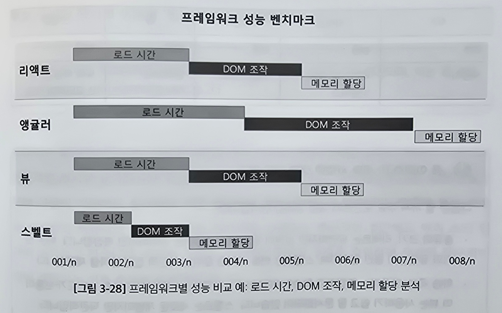

# 3.4 현대 웹 프레임워크와 라이브러리: 리액트, 앵귤러, 뷰, 스벨트

## 3.4.1 리액트, 앵귤러, 뷰, 스벨트 소개

### 현대 웹의 선구자: 리액트와 앵귤러

리액트는 넘기겠음

---

앵귤러 - 구글이 개발한 MVC 프레임워크

양방향 데이터 바인딩, 종속성 주입, 타입스크립트 사용을 통해 엄격한 타입 검사

학습곡선이 리액트보다 높음

### 떠오르는 별: 뷰와 스벨트

뷰 - 적응성으로 인기를 끄는 프레임워크

학습곡선이 낮음.

사용하기 쉽고 성능이 뛰어난 동적 UI 솔루션을 제공

---

스벨트

DOM을 업데이트하고자 최적화된 명령적 코드를 생성해 
작업을 브라우저에서 빌드 단계로 옮기는 접근법을 취함

런타임 성능이 좋음

### 성능 벤치마크: 비교 분석

리액트 - 가상DOM이 빠른 렌더링을 제공하지만 규모가 커지면 추가 최적화 필요

앵귤러 - 일관된 성능 제공, 프레임워크 크기로 인해 초기 로드 시간이 길어짐

뷰 - 성능과 최적화 사이의 균형을 잘 맞춤

스벨트 - 빌드 과정에서 DOM을 조작하는 코드를 생성해 성능 면에서 탁월

### 학습 곡선: 용이성 대 복잡성

리액트 - 컴포넌트 기반 접근 방식과 JS의 광범위한 활용한 JS 개발자가 쉽게 배울 수 있게 함 
그래도 리액트 생태계를 완전히 익히기는 어려움

앵귤러 - 학습 곡선이 가파르고 TS와 MVC 아키텍처에 대한 이해가 필요함

뷰 - 간단하고 쉽게 배울 수 있음

스벨트 - 새로운 패러다임이라 새로운 도전을 제시. 잠재적으로 큰 성과를 가져옴

## 3.4.2 프레임워크 비교 분석

| 특징          | 리액트               | 앵귤러       | 뷰               | 스벨트                  |
| :------------ | :------------------- | :----------- | :--------------- | :---------------------- |
| 종류          | 라이브러리           | 프레임워크   | 프레임워크       | 컴파일러                |
| 초기 릴리즈   | 2013년               | 2010년       | 2014년           | 2019년                  |
| 크기(KB)      | ~100                 | ~500         | ~80              | ~10(런타임)             |
| 깃허브 스타   | 214K                 | 90K          | 205K             | 73K                     |
| 학습 곡선     | 보통                 | 가파름       | 쉬움             | 보통                    |
| 데이터 바인딩 | 단방향               | 양방향       | 양방향           | 양방향                  |
| DOM           | 가상DOM              | 일반DOM      | 가상DOM          | 컴파일 타임 DOM         |
| TS 지원       | Y                    | Y            | Y                | Y                       |
| 커뮤니티 지원 | 높음                 | 높음         | 중간             | 성장 중                 |
| 성능          | 높음                 | 보통         | 높음             | 높음                    |
| 사용처        | 메타, 우버, 넷플릭스 | 구글, 포브스 | 알리바바, 샤오미 | 뉴욕 타임스, 스포티파이 |

## 3.4.3 차세대 프레임워크: Next.js, 넉스트, 스벨트킷

| 기능/기준     | Next.js                                  | 넉스트(Nuxt)                                   | 스벨트킷(SvelteKit)                             |
| :------------ | :--------------------------------------- | :--------------------------------------------- | :---------------------------------------------- |
| 기반 기술     | 리액트                                   | 뷰                                             | 스벨트                                          |
| 성능          | 높음 (자동 코드 분할 및 프리 페칭)    | 높음 (뷰에 최적화, 서버 사이드 렌더링 포함) | 매우 높음 (가상DOM 없음, 컴파일 시간 최적화) |
| 개발자 경험   | 우수 (간편한 라우팅, API 라우트 제공) | 우수 (파일 기반 라우팅, 강력한 플러그인)    | 직관적 (단순한 상태관리, 가상 DOM없음)       |
| 생태계        | 큼                                       | 큼                                             | 성장중                                          |
| 학습 곡선     | 중간                                     | 중간                                           | 쉬움에서 중간                                   |
| 커뮤니티 지원 | 강함                                     | 강함                                           | 신흥                                            |
| 빌드 및 배포  | 최적화됨(버셀에 but 적응가능)            | 유연함(다양한 플랫폼 가능)                     | 유연함(적응 가능한 빌드, 어디든 배포 가능)      |

### 넉스트, 스벨트킷 이해하기

넉스트 - 뷰를 기반으로 한 유니버설 뷰 애플리케이션을 만드는 프레임워크 
SSR, SSG를 위한 뷰 애플리케이션의 개발을 간소화하고 강력한 설정 옵션과 플러그인 제공

스벨트킷 - 스벨트를 기반으로 한 애플리케이션 프레임워크 
가상DOM을 사용하지 않고 컴포넌트를 DOM을 조작하는 명령형 코드로 컴파일함

### 성능 및 개발 경험

스벨트킷이 독특한 상태관리와 반응성으로 눈에 띔 
가상DOM을 사용하지 않아 더 빠른 성능 제공

커뮤니티 면에서는 스벨트킷이 밀림
