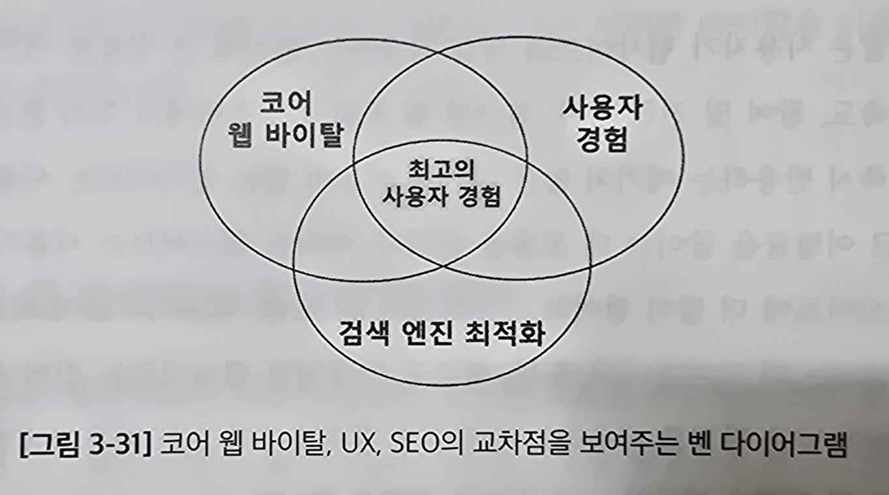

# 3.5 코어 웹 바이탈: 사용자 경험을 개선하는 접근

요즘은 사용자 경험(UX)가 중요함

코어 웹 바이탈이라는 UX질을 평가하는 표준화된 지표가 등장함

## 3.5.1 코어 웹 바이탈의 중요성 및 영향

2020 년 구글이 발표함

#### 3가지 지표

- 최대 콘텐츠 렌더링 시간(Largest Contentful Paint, LCP) 
  뷰포트 내에 가장 큰 콘텐츠를 렌더링 하는 데 걸리는 시간 
  페이지의 로딩 성능 평가 
  페이지 로딩 시작 후 2.5초 이내의 LCP가 발생해야함
- 첫 입력 지연(First Input Delay, FID) 
  사이트와 처음 상호작용부터 브라우저가 반응할때 까지의 지연 시간 
  100ms 미만이어야함
- 레이아웃 변경 횟수(Cumulative Layout Shift, CLS) 
  시각적 안정성을 측정 
  예기치 않은 레이아웃 변경 정도를 수치화함 
  0.1 이하의 CLS 유지

## 3.5.2 사용자 경험과 SEO에 미치는 코어 웹 바이탈의 영향

코어 웹 바이탈은 사용자 경험의 광범위한 영역을 아우름 
웹사이트와의 상호작용을 포함하여 탐색의 용이성, 시각적 매력, 콘텐츠의 적합성 등을 포함

**SEO는 이런 다양한 요소를 종합해 웹사이트의 검색 순위를 높이는 데 중점을 둠**

웹사이트 UX는 성능과 신뢰성을 인식하는 방식에서 시작됨 
이 과정에서 코어 웹 바이탈은 중대한 역할을 수행함

- **LCP**: 최대 콘텐츠 렌더링 시간이 느릴 때 
  사이트가 느리다고 느끼는 사용자의 인상에 직접적으로 영향을 미침
- **FID**: 사용자 상호 작용에 대한 응답이 지연 
  사용자의 실망강을 부르고 사이트 이탈로 이어짐
- **CLS**: 예상치 못한 레이아웃 변경 
  사용자에게 혼란과 불편함을 주고 전반적인 사용자 경험을 악화

코어 웹 바이탈은 구글이 웹사이트를 평가하고 순위를 매기는 방식에도 영향을 끼침

#### 훌륭한 Ux 디자인의 요소

- **탐색성**: 사용자가 원하는 정보나 기능을 찾기 쉬워야함 
  직관적인 탐색구조
- **가독성**: 콘텐츠가 읽기 쉽고 이해하기 쉬워야함 
  글꼴, 색상 대비, 문장 구조 등을 통해
- **접근성**: 모든 사용자가 능력과 상황에 관계 없이 사이트를 사용할 수 있어야함 
  텍스트 크기 조정, 스크린 리더 최적화 등
- **관련성**: 사이트의 콘텐츠는 사용자의 필요, 관심사와 일치해야함 
  타겟을 이해하고 요구에 맞는 콘텐츠를 제공

> 요즘 SEO는 콘텐츠가 사용자 친화적인지 중점을 둠 
> 그렇기 때문에 요즘은 모바일 사용자가 많기 때문에 모바일 친화적 디자인이 필수임
>
> HTTPS 등을 사용해 사용자 데이터의 보안을 보장
>
> 과도함 팝업 광고를 제한해야 함

## 3.5.3 웹 성능을 평가하는 도구와 기법

`측정하는 것만이 관리할 수 있다`

#### 성능 측정과 최적화에 도움을 주는 도구

- **페이지스피드 인사이트(PageSpeed Insights)** 
  실험실 데이터와 현장 데이터를 모두 제공하여 웹페이지의 성능을 평가함 
  LCP, FID, CLS 등의 성능 지표를 분석하는데 사용
- **크롬 개발자 도구(Chrome DevTools)** 
  성능 측정과 에뮬레이션하는 다양한 기능을 포함 
  _성능_ 패널을 통해 런타임 성능을 분석, _경험_ 섹션에서 코어 웹 바이탈 데이터를 강조
- **라이트하우스(Lighthouse)** 
  웹페이지의 전반적인 품질을 개선하는 자동화된 도구 
  성능, 접근성, 진보적 웹 애플리케이션, SEO 등의 영역에서 감사를 진행
- **크롬 사용자 경험 보고서(Chrome User Experience Report, CrUX)** 
  실제 사용자 경험 데이터를 제공하는 공개 데이터 세트 
  실제 프로젝트에서의 웹 페이지 성능을 이해하는데 도움이됨

#### Next.js 가 제공하는 성능 측정과 최적화에 특화된 도구

- **Next.js 애널리틱스**: 애플리케이션의 실제 성능 데이터를 제공 
  사용자 경험을 파악하고 애플리케이션의 성능 병목현상을 식별
- **Next.js 프로파일러**: 리액트 개발 도구의 프로파일러와 통합해 컴포넌트의 성능을 측정, 분석 
  애플리케이션의 성을을 상세하게 파악하고 개선가능

#### 웹사이트 성능을 모니터링하는 서드파티 솔루션

- **웹페이지테스트(WebPageTest, webpagetest.org)** 
  웹페이지의 성능을 다각도록 테스트하고 종합적인 결과를 제공함 
  여러 지역과 브라우저의 테스트 옵션을 포함해 웹사이트 성능의 깊이있는 분석을 제공
- **GT메트릭스(GTmetrix, gtmetrix.com)** 
  구글 라이트하우스를 활용해 웹페이지의 속도와 성능을 분석 
  개선에 필요한 구체적인 권장사항을 제공해 웹사이트 최적화에 도움을 줌

> 개발 단계 - 크롬 개발자 도구를 통해 성능 분석 
> 로컬 환경 - 라이트하우스를 통해 초기 성능 문제 파악 
> 배포 전 - Next.js 분석 기능과 프로파일러를 통해 변경 사항이 성능에 미치는 영향 검사 
> 배포 후 - 페이지 인사이트와 크롬 사용자 경험 보고서를 통해 웹사이트 성능 모니터링

## 3.5.4 LCP, FID, CLS 지표의 최적화 전략

#### LCP 개선 전략

웹 페이지의 로딩 성능을 측정하는 지표

- 이미지 최적화 및 압축 
  WebP를 사용해 이미지를 압축하고 반응형 이미지 사용으로 LCP 개선 
  Next.js의 `next/image`컴포넌트를 활용해 자동으로 이미지 최적화
- 렌더링 차단 리소스 제거 
  CSS와 JS 파일 중 렌더링을 차단하는 제거하거나 연기함 
  중요한 CSS는 인라인으로 배치하고 중요하지 않은 JS는 지연
- 사전 로딩 활용 
  페이지 로딩 시간을 단축하려고 중요 리소스를 미리 로드
- SSR 또는 SSG 
  Next.js의 사전 렌더링 기능을 활용해 페이지를 미리 렌더링하고 클라이언트 부하 줄임 
  브라우저가 사전 렌더링된 HTML을 받아 사용자에게 즉시 표시해 LCP 시간을 개선

#### 첫 입력 지연(FID) 향상

웹사이트의 상호작용성과 응답성을 측정하는 지표

- JS 최소화 및 지연 로딩 
  용량이 큰 JS의 실행은 사용자 상호 작용을 지연시킬 수 있음 
- 웹 워커 사용 
  사용자 인터페이스와 관련 없는 작업을  
  백그라운드에서 실행하는 웹 워커를 사용해 메인 스레드의 차단을 줄임
- 초기 페이지 로드에 대한 SSR 구현 
  서버에서 페이지를 완전히 렌더링해 제공하여 초기 로드 시 클라이언트 측 JS의 부하를 줄임 
  사용자의 첫 상호 작용을 빠르게 만들어 FID를 개선
- 브라우저 캐싱을 활용 
  반복 방문자가 캐싱을 활용해 로딩 시간을 줄이도록 FID를 향상
- Next.js 프리페칭 및 서버 캐싱

#### 레이아웃 변경 횟수(CLS) 완화하기

시각적 안정성을 측정하는 지표

- 이미지와 내장 요소 공간 예약 
  이미지와 미디어 요소의 고정 종횡비를 설정 
  페이지 로딩 중 발생하는 레이아웃 리플로우를 방지
- 새로운 UI 요소를 접는 부분 아래에 추가 
  새 UI 요소는 사용자 상호 작용에 응답하지 않는 한 
  페이지의 접는 부분 아래에 추가해야함 
  기존 내용 위에 콘텐츠가 갑자기 삽입되어 레이아웃이 변경되는 것을 방지
- 웹 폰트 안정화 
  폰트 로딩으로 인한 레이아웃 변화를 최소화 
  `font-display: optional` 속성 사용, 혹은 중요한 폰트를 미리 로드
- 콘텐츠의 재배치 방지 
  플레이스 홀더나 스켈레톤 화면을 활용해 콘텐츠가 위치할 공간을 예약 
  동적 요소 추가 시 레이아웃 이동을 방지
- 이미지 공간 예약 
  `next/image` 컴포넌트는 개발자에게 `width`와 `height`를 지정하도록 요구해 
  필요한 공간을 예약하고 이미지 로딩 시 콘텐츠 리플로우를 방지함
