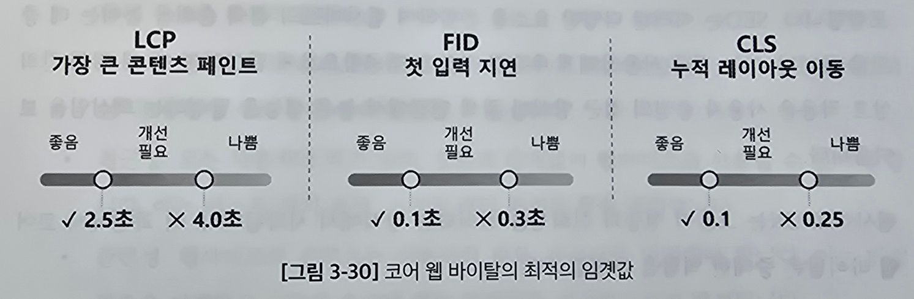

# 3.5 코어 웹 바이탈: 사용자 경험을 개선하는 접근

요즘은 사용자 경험(UX)가 중요함

코어 웹 바이탈이라는 UX질을 평가하는 표준화된 지표가 등장함

## 3.5.1 코어 웹 바이탈의 중요성 및 영향

2020 년 구글이 발표함

#### 3가지 지표

- 최대 콘텐츠 렌더링 시간(Largest Contentful Paint, LCP) 
  뷰포트 내에 가장 큰 콘텐츠를 렌더링 하는 데 걸리는 시간 
  페이지의 로딩 성능 평가 
  페이지 로딩 시작 후 2.5초 이내의 LCP가 발생해야함
- 첫 입력 지연(First Input Delay, FID) 
  사이트와 처음 상호작용부터 브라우저가 반응할때 까지의 지연 시간 
  100ms 미만이어야함
- 레이아웃 변경 횟수(Cumulative Layout Shift, CLS) 
  시각적 안정성을 측정 
  예기치 않은 레이아웃 변경 정도를 수치화함 
  0.1 이하의 CLS 유지

## 3.5.2 사용자 경험과 SEO에 미치는 코어 웹 바이탈의 영향
