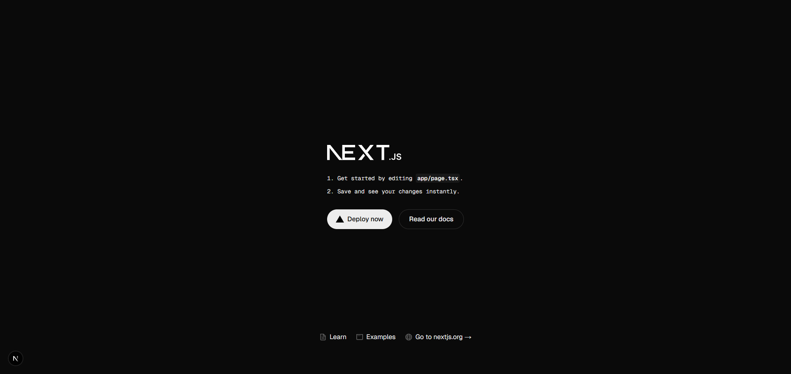

# 4.3 첫 Next.js 프로젝트 시작: 보일러플레이트 애플리케이션

## 4.3.1 프로젝트 생성과 개발 서버 실행

`create-next-app` => Next.js 의 기본적인 시작점.

```
-- 개발 서버 실행
npm run dev
```

> 애플리케이션 생성 전에는 nextjs-template.vercel.app 에서 실행결과 확인



## 4.3.2 프로젝트 구조와 설정 파일

```
# create-next-app 으로 설치한 보일러플레이트 구조

.next/                # 빌드 과정에서 생성하는 일시적인 파일이 위치
app/                  # 애플리케이션의 주요 소스 코드와 관련 파일이 위치
node_modules/         # npm을 통해 설치한 모든 종속성 모듈이 위치
public/               # 정적 파일이 위치. 브라우저에서 접근 가능
eslint.config.mjs
next.config.ts        # 사용자 정의를 살정하는 파일
next-env.d.ts         # 타입스크립트 정의가 포함된 파일
package.json          # 프로젝트 메타데이터와 종속성 목록이 포함된 파일
package-lock.json     # npm 패키지의 정확한 버전 정보를 포함
postcss.config.mjs    # PostCSS 설정 파일. CSS 전처리기에 대한 설정을 포함
README.md
tsconfig.json         # 타입스크립트 프로젝트 설정 파일
```

### 프로젝트 주요 설정 파일

- **`README.md`**: 프로젝트에 대한 개요와 설치, 실행방법 등 주요 정보를 제공
- **`package.json`**: 프로젝트의 설정과 종속성 정보를 담고 있음

  > ```json
  > {
  >   "name": "next-test", // 프로젝트 명
  >   "version": "0.1.0", // 프로젝트 버전
  >   "private": true, // 비공개 여부
  >   "scripts": {
  >     // 스크립트 명령어
  >     "dev": "next dev --turbopack",
  >     "build": "next build",
  >     "start": "next start",
  >     "lint": "next lint"
  >   },
  >   "dependencies": {
  >     // 의존성 패키지 목록
  >     "react": "19.1.0",
  >     "react-dom": "19.1.0",
  >     "next": "15.4.2"
  >   },
  >   "devDependencies": {
  >     "typescript": "^5",
  >     "@types/node": "^20",
  >     "@types/react": "^19",
  >     "@types/react-dom": "^19",
  >     "@tailwindcss/postcss": "^4",
  >     "tailwindcss": "^4",
  >     "eslint": "^9",
  >     "eslint-config-next": "15.4.2",
  >     "@eslint/eslintrc": "^3"
  >   }
  > }
  > ```

- **`next.config.ts`**: Next.js의 사용자 정의 설정을 담아 프로젝트의 설정, 플러그인, 경로별칭 등 정의

  > ```ts
  > import type { NextConfig } from "next";
  >
  > const nextConfig: NextConfig = {
  >   // 설정 정의
  >   /* config options here */
  > };
  >
  > export default nextConfig; // 설정객체를 내보냄
  > ```

- **`tsconfig.json`**: ts를 이용한 프로젝트에서 컴파일러의 동작방식과 파일의 포함여부를 정의

  > ```json
  > {
  >   "compilerOptions": {
  >     // 컴파일 동작 제어
  >     "target": "ES2017", // 컴파일될 js 파일의 ES버전
  >     "lib": ["dom", "dom.iterable", "esnext"], // 프로젝트에서 사용할 라이브러리
  >     "allowJs": true, // js를 ts로 컴파일
  >     "skipLibCheck": true, // 선언 파일의 타입 검사 생략
  >     "strict": true, // 엄격한 타입 검사 활성화
  >     "noEmit": true, // 출력 파일 비생성 여부
  >     "esModuleInterop": true, // ES모듈과 CommonJS 모듈 간의 상호 운용성을 위한 코드 생성 활성화
  >     "module": "esnext", // 모듈 시스템
  >     "moduleResolution": "bundler", // 모듈 해석 방식
  >     "resolveJsonModule": true,
  >     "isolatedModules": true,
  >     "jsx": "preserve", // jsx 코드 처리방식
  >     "incremental": true, // 증분 컴파일 사용여부(빌드시간 단축)
  >     "plugins": [
  >       // 타입스크립트 플러그인 지정
  >       {
  >         "name": "next"
  >       }
  >     ],
  >     "paths": {
  >       // 모듈 별칭 설정
  >       "@/*": ["./*"]
  >     }
  >   },
  >   "include": [
  >     // 컴파일 과정에서 포함될 파일, 폴더 목록 정의
  >     "next-env.d.ts",
  >     "**/*.ts",
  >     "**/*.tsx",
  >     ".next/types/**/*.ts"
  >   ],
  >   "exclude": ["node_modules"] // 컴파일에서 제외할 파일, 폴더
  > }
  > ```

  > #### 타입스크립트 설정을 조정해야 하는 때
  >
  > - 새로운 라이브러리/프레임워크 사용
  > - 타입 검사 업격도 조절(strict, strictNullChecks, noImplicitAny...)
  > - 모듈 별칭 및 경로 설정
  > - JSX 처리방식 변경(react 외의 다른 라이브러리를 쓰면서 jsx 처리 방식을 변경해야 할 때)
  > - 다른 ECMAScript 버전 대상
  > - 컴파일 때 포함, 제외할 파일이 변경 될 때
  > - 빌드 성능을 개선하거나 최적화 기법을 사용할고 싶을 때(incremental 옵션)
  > - 특정 타입스크립트 플러그인 사용하려 할 때

### public/ 폴더: 공개적으로 접근 가능한 정적 리소스 파일 저장

public/ 폴더는 정적 파일을 호스팅하는데 사용됨<br>
프로젝트의 루트 URL을 통해 직접 접근

이 폴더에 저장된 파일은 웹팩이나 Next.js에 의해 변환되거나 최적화되지 않고 그대로 제공됨<br>
이미지 최적화나 파일 번들링 등 최적화 작업은 적용 안됨

> Next.js 는 public 내의 이미지를 자동으로 최적화 하지는 않지만<br>
> Image 컴포넌트를 사용해 이미지 로드 성능을 개선 가능

파비콘(favicon), robots.txt, sitemap.xml, 웹 메니페스트(manifest) 등 특별한 파일을 저장하는데 사용

**_민감한 정보나 파일을 저장하면 안됨_**

### app/ 폴더: 웹 애플리케이션의 디자인과 라우팅 구조를 결정

app/ 폴더는 웹 프로젝트 구조의 중심.<br>
프로젝트의 주요 요소가 포함됨

`favicon.ico` -> 웹사이트를 대표하는 아이콘<br>
`globals.css` -> 웹 애플리케이션 전체에 걸쳐 적용되는 스타일<br>
`layout.tsx` -> 웹 페이지의 공통적인 구조와 레이아웃을 정의하는 컴포넌트<br>
`page.tsx` -> 웹 사이트의 주 페이지를 담당하는 컴포넌트

app/ 폴더는 기본적인 라우팅을 제공하는 폴더임

http://localhost:3000/ 으로 접근하면 기존웹은 index.html 이 반환됨<br>
Next.js 는 app/layout.tsx 와 app/page.tsx 가 그 역할을 함

## 4.3.3 소스 코드 상세 분석

### 레이아웃 app/layout.tsx 파일 분석

기본적인 페이지 구조를 설정하는 역할

공통으로 사용될 스타일과 폰트의 구조 정의

```tsx
import type { Metadata } from "next";
import { Geist, Geist_Mono } from "next/font/google"; // 구글 폰트
import "./globals.css"; // 전역 스타일 시트

const geistSans = Geist({
  variable: "--font-geist-sans",
  subsets: ["latin"],
});

const geistMono = Geist_Mono({
  variable: "--font-geist-mono",
  subsets: ["latin"],
});

// 메타데이터 설정
export const metadata: Metadata = {
  title: "Create Next App",
  description: "Generated by create next app",
};

// children 속성을 통해 다른 페이지나 컴포넌트를 렌더링함
export default function RootLayout({
  children,
}: Readonly<{
  children: React.ReactNode;
}>) {
  return (
    <html lang="en">
      <body
        className={`${geistSans.variable} ${geistMono.variable} antialiased`}
      >
        {children}
      </body>
    </html>
  );
}
```

### 웹 콘텐츠 app/page.tsx 파일 분석

웹 페이지의 구조와 스타일을 정의하는 파일

```tsx
import Image from "next/image"; // 이미지 최적화를 위해 임포트

// 페이지의 주요 콘텐츠를 담당
export default function Home() {
  return (
    <div className="font-sans grid grid-rows-[20px_1fr_20px] items-center justify-items-center min-h-screen p-8 pb-20 gap-16 sm:p-20">
      <main className="flex flex-col gap-[32px] row-start-2 items-center sm:items-start">
        <Image
          className="dark:invert"
          src="/next.svg"
          alt="Next.js logo"
          width={180}
          height={38}
          priority
        />
        <ol className="font-mono list-inside list-decimal text-sm/6 text-center sm:text-left">
          <li className="mb-2 tracking-[-.01em]">
            Get started by editing{" "}
            <code className="bg-black/[.05] dark:bg-white/[.06] font-mono font-semibold px-1 py-0.5 rounded">
              app/page.tsx
            </code>
            .
          </li>
          <li className="tracking-[-.01em]">
            Save and see your changes instantly.
          </li>
        </ol>

        <div className="flex gap-4 items-center flex-col sm:flex-row">
          <a
            className="rounded-full border border-solid border-transparent transition-colors flex items-center justify-center bg-foreground text-background gap-2 hover:bg-[#383838] dark:hover:bg-[#ccc] font-medium text-sm sm:text-base h-10 sm:h-12 px-4 sm:px-5 sm:w-auto"
            href="https://vercel.com/new?utm_source=create-next-app&utm_medium=appdir-template-tw&utm_campaign=create-next-app"
            target="_blank"
            rel="noopener noreferrer"
          >
            <Image
              className="dark:invert"
              src="/vercel.svg"
              alt="Vercel logomark"
              width={20}
              height={20}
            />
            Deploy now
          </a>
          <a
            className="rounded-full border border-solid border-black/[.08] dark:border-white/[.145] transition-colors flex items-center justify-center hover:bg-[#f2f2f2] dark:hover:bg-[#1a1a1a] hover:border-transparent font-medium text-sm sm:text-base h-10 sm:h-12 px-4 sm:px-5 w-full sm:w-auto md:w-[158px]"
            href="https://nextjs.org/docs?utm_source=create-next-app&utm_medium=appdir-template-tw&utm_campaign=create-next-app"
            target="_blank"
            rel="noopener noreferrer"
          >
            Read our docs
          </a>
        </div>
      </main>
      <footer className="row-start-3 flex gap-[24px] flex-wrap items-center justify-center">
        <a
          className="flex items-center gap-2 hover:underline hover:underline-offset-4"
          href="https://nextjs.org/learn?utm_source=create-next-app&utm_medium=appdir-template-tw&utm_campaign=create-next-app"
          target="_blank"
          rel="noopener noreferrer"
        >
          <Image
            aria-hidden
            src="/file.svg"
            alt="File icon"
            width={16}
            height={16}
          />
          Learn
        </a>
        <a
          className="flex items-center gap-2 hover:underline hover:underline-offset-4"
          href="https://vercel.com/templates?framework=next.js&utm_source=create-next-app&utm_medium=appdir-template-tw&utm_campaign=create-next-app"
          target="_blank"
          rel="noopener noreferrer"
        >
          <Image
            aria-hidden
            src="/window.svg"
            alt="Window icon"
            width={16}
            height={16}
          />
          Examples
        </a>
        <a
          className="flex items-center gap-2 hover:underline hover:underline-offset-4"
          href="https://nextjs.org?utm_source=create-next-app&utm_medium=appdir-template-tw&utm_campaign=create-next-app"
          target="_blank"
          rel="noopener noreferrer"
        >
          <Image
            aria-hidden
            src="/globe.svg"
            alt="Globe icon"
            width={16}
            height={16}
          />
          Go to nextjs.org →
        </a>
      </footer>
    </div>
  );
}
```

> ### 반응형 디자인을 하는 테일윈드CSS의 접두어와 클래스
>
> - 모바일을 위한 스타일링<br>
>   테일윈드는 모바일 우선 방식을 따름<br>
>   별도의 접두어가 없으면 모바일 화면 기준으로 적용됨
> - 태블링 기기를 위한 스타일링: `md:` 접두어 사용
> - 노트북 기기를 위한 스타일링: `lg:` 접두어 사용
> - 데스크톱 기기를 위한 스타일링: `xl:` 접두어 사용
