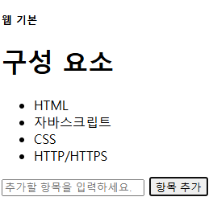

# 5.1 Next.js 를 위한 리액트 개요

## 5.1.1 자바스크립트에서 리액트로 전환

HTML, CSS, 바닐라 js 에서 리액트로의 전환을 이해하자

```html
// vanila.html
<!DOCTYPE html>
<html lang="ko">
  <head>
    <meta charset="UTF-8" />
    <meta http-equiv="X-UA-Compatible" content="IE=edge" />
    <meta name="viewport" content="width=device-width, initial-scale=1.0" />
    <title>바닐라 JS 예제</title>
  </head>

  <body>
    <div>
      <h5>웹 기본</h5>
      <h1>구성 요소</h1>
      <ul id="itemList">
        <li>HTML</li>
        <li>자바스크립트</li>
        <li>CSS</li>
      </ul>
      <input
        type="text"
        id="itemInput"
        placeholder="추가할 항목을 입력하세요."
      />
      <button onclick="addItem()">항목 추가</button>
      <script>
        function addItem() {
          const input = document.getElementById("itemInput");
          const list = document.getElementById("itemList");
          const newItem = document.createElement("li");
          newItem.textContent = input.value;
          list.appendChild(newItem);
          input.value = "";
        }
      </script>
    </div>
  </body>
</html>
```

 

위 예제는 작동하지만 제한 사항이 있음.<br/>
DOM을 직접 조작하는 방식은 애플리케이션이 커질수록 비효율적이고 관리하기 어려움

### 리액트 컴포넌트로 전환

```jsx
function ItemList() {
  const [items, setItems] = React.useState([]);
  const [inputValue, setInputValue] = React.useState("");

  const addItem = () => {
    setItems([...items, inputValue]);
    setInputValue("");
  };
  return (
    <div>
      <h5>웹 기본</h5>
      <h1>구성 요소</h1>
      <ul id="itemList">
        <li>HTML</li>
        <li>자바스크립트</li>
        <li>CSS</li>
        {items.map((item, index) => (
          <li key={index}>{item}</li>
        ))}
      </ul>
      <input
        type="text"
        value={inputValue}
        onChange={(e) => setInputValue(e.target.value)}
        placeholder="항목 추가"
      />
      <button onClick={addItem}>항목 추가</button>
    </div>
  );
}
```

리액트 코드는 DOM 요소를 직접 조작하지 않고 </br>
리액트의 선언형 패러다임을 활용해 사용자 인터페이스를 관리함

개발자는 상태가 어떻게 보여야 할지만 선언하고</br>
DOM 조작은 리액트가 내부적으로 처리함

아래처럼 쓰면 리액트 라이브러리 설치없이도 실행할 수 있음

```html
<!DOCTYPE html>
<html lang="ko">
  <head>
    <meta charset="UTF-8" />
    <meta http-equiv="X-UA-Compatible" content="IE=edge" />
    <meta name="viewport" content="width=device-width, initial-scale=1.0" />
    <title>리액트 예제</title>
  </head>

  <body>
    <div id="app"></div>
    <script src="https://unpkg.com/react@17/umd/react.development.js"></script>
    <script src="https://unpkg.com/react-dom@17/umd/react-dom.development.js"></script>
    <script src="https://unpkg.com/@babel/standalone/babel.min.js"></script>
    <script type="text/jsx">
      const app = document.getElementById("app");

      function ItemList() {
        const [items, setItems] = React.useState([]);
        const [inputValue, setInputValue] = React.useState("");

        const addItem = () => {
          setItems([...items, inputValue]);
          setInputValue("");
        };
        return (
          <div>
            <h5>웹 기본</h5>
            <h1>구성 요소</h1>
            <ul id="itemList">
              <li>HTML</li>
              <li>자바스크립트</li>
              <li>CSS</li>
              {items.map((item, index) => (
                <li key={index}>{item}</li>
              ))}
            </ul>
            <input
              type="text"
              value={inputValue}
              onChange={(e) => setInputValue(e.target.value)}
              placeholder="항목 추가"
            />
            <button onClick={addItem}>항목 추가</button>
          </div>
        );
      }

      ReactDOM.render(<ItemList>, app)
    </script>
  </body>
</html>
```

> ### 리액트는 이제 Create-React-App으로 프로젝트 생성을 추천하지 않음
>
> CRA는 성능문제, 무거운 설정 과정, 오래된 종석성 사용 등의 문제가 있었음
>
> 그래서 SPA 개발에는 Vite와 Parcel이 추천되고 <br>
> 서버 랜더링 앱 개발은 Next.js와 Remix 가 추천됨

### 바닐라 JS와 리액트의 비교

리액트는 더 체계적이고 모듈화된 방법을 제공함

선언적 특성을 통해 코드를 읽고 이해하기 쉽게 하며

변경된 DOM 부분만 업데이트하여 효율적인 업데이트와 렌더링을 함

자주 업데이트되고 사용자와 상호작용이 많을 때 효과적임

바닐자 JS => 리액트 == 명령형 패러다임 => 선언형 패러다임

## 5.1.2 리액트의 핵심 원리와 철학

- 리액트는 **선언형 UI를 중시**함
- **컴포넌트 기반 아키텍처**를 채택
- **가상 DOM**의 사용
- **데이터의 단방향 흐름을 지향**
- 학습하기 쉬운 API를 제공하고 다른 라이브러리나 프레임워크와 유연한 통합이 가능

### 선언형 프로그래밍 방식으로 UI 구축

명령형 프로그래밍은 개발자가 UI의 각 부분을 어떻게 변경할지 직접 지정해야하며<br>
상태 변화에 따라 이런 변경 사항을 수동으로 관리해야함

선언형 프로그래밍은 UI의 상태와 구조를 명확하고 직관적으로 선언하고<br>
리액트가 이에 따라 DOM을 업데이트함

### 컴포넌트 기반 아키텍처

함수형 컴포넌트는 독립적이며 재사용 가능항 사용자 인터페이스의 조각임<br>
props 라는 속성 파라미터를 받아 사용자 인터페이스의 계층 구조를 반환

```js
// 함수형 컴포넌트의 기본 구조
function 컴포넌트명(props) {
  // UI 로직과 JSX 렌더링
  return <태그>...</태그>;
}
```

함수형 컴포넌트르 통한 모듈식 접근 방식은 UI 구축 시 재사용성을 높이고 관심사의 분리를 용이하게 함

props 객체는 컴포넌트에 전달되는 매개변수의 모음으로<br>
부모 컴포넌트에서 데이터를 받아 자식 컴포넌트에서 사용됨

> ### 함수형 컴포넌트 속성을 타입스크립트로 하는 구조 예
>
> ```ts
> type Props = {
>   // props의 타입을 정의합니다
>   name: string;
>   age?: number; // 옵셔널 프로퍼티
> };
> function Welcome(props: Props) {
>   return <h4>Hello, {props.name}</h4>;
> }
> ```
>
> ts를 사용함으로써 컴포넌트의 props와 내부 상태에 대해<br>
> 더 엄격하게 타입 체크를 하며 이는 오류 예방에 도움을 줌

### 리액트 생태계: 리액트의 기능을 확장하는 라이브러리와 도구

상태 관리 - 리덕스, MobX, Zustand, Recoil, XState

데이터 처리와 관리 - GraphQL, Apollo

앱 내 라우팅 - 리액트 라우터

UI구성 - Material-UI, Ant Design, Chakra UI

테스팅 - Jest, 리액트 테스팅 라이브러리

애니메이션 - Framer Motion, 리액트 스프링

서버 사이트 렌더링, 정적 사이트 생성 - Next.js, Gatsby

폼 관리 - Formik, 리액트 훅 폼

### 5.1.3 Next.js 프레임워크에서 리액트 개발

Next.js 환경에서 컴포넌트를 만들어보자

먼저 create-next-app 으로 프로젝트 생성

```
npx create-next-app@latest levelup-react
cd levelup-react
code .
```

ItemList 컴포넌트를 .tsx 형식으로 변경해보자

```ts
"use client";
import React from "react";

type Props = {
  name: string;
  age?: number;
};

function Welcome(props: Props) {
  return <h4>Hello, {props.name}</h4>;
}

function ItemList() {
  const [items, setItems] = React.useState<string[]>([]);
  const [inputValue, setInputValue] = React.useState<string>("");

  const addItem = () => {
    setItems([...items, inputValue]);
    setInputValue("");
  };
  return (
    <div>
      <h5>웹 기본</h5>
      <h1>구성 요소</h1>
      <ul id="itemList">
        <li>HTML</li>
        <li>자바스크립트</li>
        <li>CSS</li>
        {items.map((item, index) => (
          <li key={index}>{item}</li>
        ))}
      </ul>
      <input
        type="text"
        value={inputValue}
        onChange={(e) => setInputValue(e.target.value)}
        placeholder="항목 추가"
      />
      <button onClick={addItem}>항목 추가</button>
    </div>
  );
}

export default ItemList;
```

#### 순수 리액트 코드와의 차이점

1. 'use client' 지시어: 해당 컴포넌트가 클라이언트 브라우저에서만 실행되어야 함을 명시
2. 타입스크립트 사용: ts 를 사용해 타임으 명시적으로 지정
3. 모듈로 내보내기

Next.js 에서 메인 콘텐츠를 변경하고자 app/page.tsx 파일을 수정해 ItemList 컴포넌트를 보여줘보자

```tsx
import ItemList from "./item-list";
export default function Home() {
  return (
    <main className="flex flex-col p-4">
      <ItemList />
    </main>
  );
}
```

마지막으로 일관된 스타일링을 위해 CSS 스타일을 초기화

```css
/* app/global.css */
@tailwind base;
@tailwind components;
@tailwind utilities;

/* 근데 tailwindcss 4 버전부터 아래 한줄이면 됨*/
@import "tailwindcss";
```

서버 실행

```
npm run dev
```
